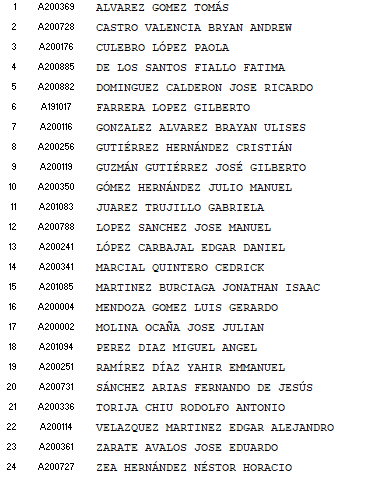
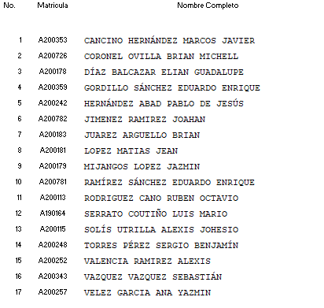

## A1. 2 Elaborar un reporte de análisis por lo menos seleccionar un tema .

Investigar en distintas fuentes y elaborar un análisis de los siguientes temas:

1. Introducción a la recolección de la información.
2. Identificación de la infraestructura.
3. Fingerprint a aplicaciones y frameworks.
4. Fingerprint a aplicaciones a medida.
5. Enumeración de recursos.
6. Exposición de información por malas configuraciones.
7. Google Hacking.
8. Shodan HQ.
9. Conceptos del protocolo HTTP y HTTPS.
10. Codificación (Charset, HTML encoding, URL encoding).
11. Same Origin Policy.
12. Cookies y Sesiones.
13. Webapp proxies.
14. Conceptos básicos del XSS.
15. Anatomía de una explotación vía Cross Site Scripting.
16. Los 3 tipos de XSS.
17. Cómo encontrar/identificar esta vulnerabilidad.
18. Explotación vía XSS.
19. Cómo mitigar este riesgo.
20. Introducción a las inyecciones SQL.
21. Cómo encontrar este tipo de vulnerabilidades.
22. In-Band SQL injections.
23. Error Based SQL Injections.
24. Blind SQL Injections.
25. Introducción a SQL map.
26. Estrategias de mitigación.
27. Explotación avanzada a través de SQL Injections.
28. Ataques de sesión.
29. CSRF (Cross-Site Request Forgery).
30. Ataques a través de archivos y recursos.

Deberá contener el documento:

Resumen.
Introducción del tema.
Resultados
Bibliografía.

Se anexa la lista en esta lista es de acuerdo al tema, es decir el numero 1,. Tomas le toca profundizar el tema introducción a la recolección de información.

y asi sucesivamente....ningún tema debe ser repetido

