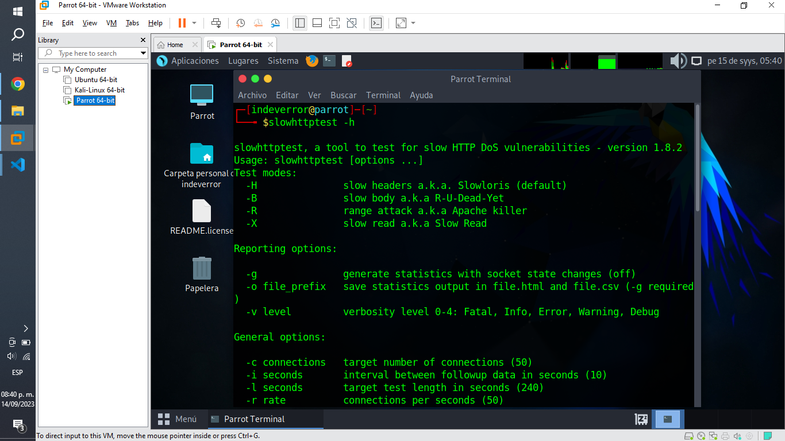
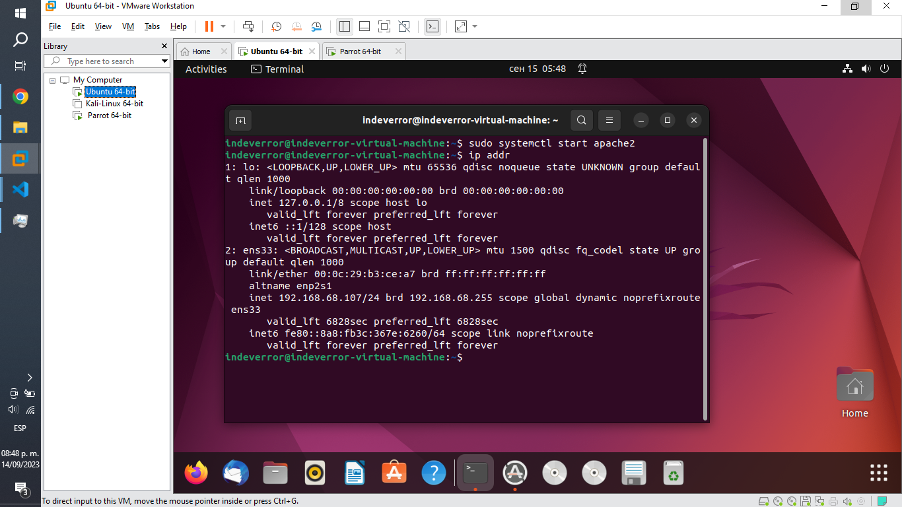
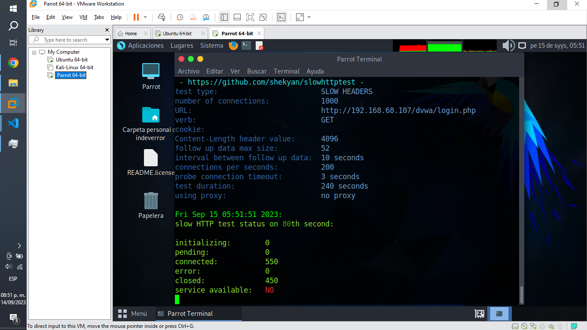
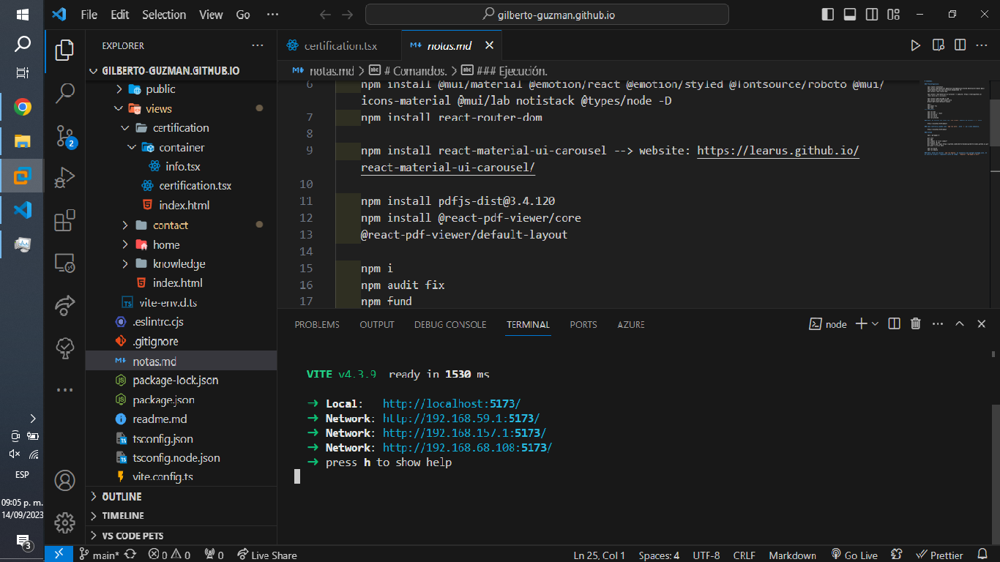
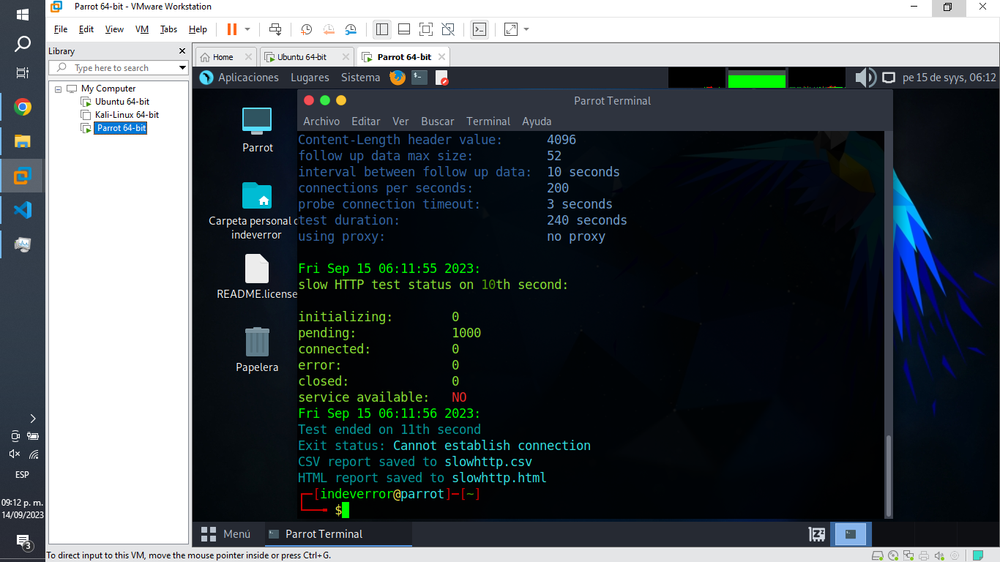
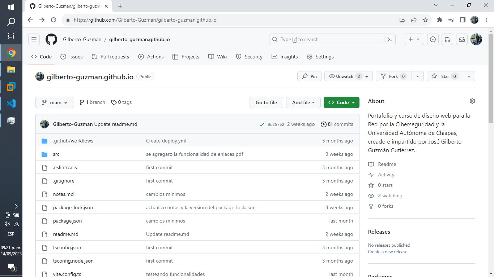
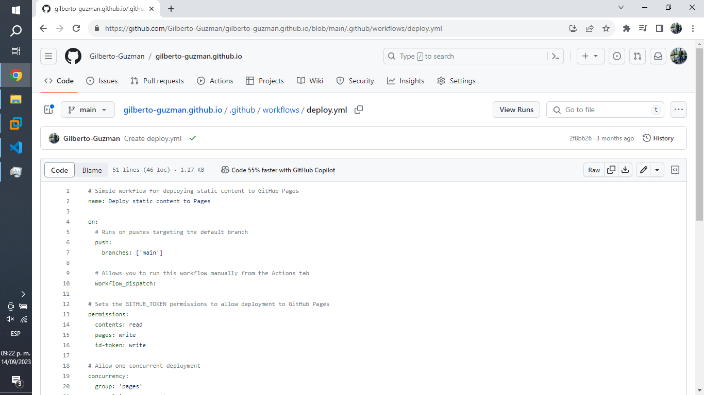

# Actividad 2.2 Realizar ataque DoS utilizando herramientas Slowloris en Kali Linux a Windows 10

## ¡Importante!

Para el desarrollo de esta y muchas más actividades se ha estado utilizando Parrot, esto debido a que Kali Linux tiene algunos problemas de compatibilidad con mi tarjeta de red, siendo que la marca Realtek no tiene soporte oficial en la mayoría de las distribuciones de linux, sin embargo cabe resaltar que los comandos y procesos mostrados son iguales, debido a que ambos están basados en debian.

## Introducción.

En el presente trabajo a entregar, se pretende realizar varios ataques de denegación de servicios mediante el uso de herramienta slowhttptest y el algoritmo Slowloris, veremos en total 3 ataques, el primero es a dvwa, usando como host a Ubuntu, el segundo es a mi página web de react, usando como host a Windows y el tercero es nuevamente a mi página web de react, pero utilizando como host a Github Pages. Los fines de esta y muchas más actividades son meramente educativas, y nunca se recomienda ni incentiva realizar estas acciones por razones éticas y legales.

## Desarrollo del Tema (Slowloris).

### 1. Muestra la ayuda e información de uso disponible.

    slowhttptest -h

### 2. Usando el algoritmo de Slowloris hacemos un ataque DOS de testeo a nuestro host.

#### Para DVWA (Red Local).

Requisitos preliminares:

Inicializar nuestro servidor de apache en Ubuntu y conocer nuestra ip actual asignada.

    sudo systemctl start apache2
    ip addr

Ejecución del código:

    slowhttptest -c 1000 -H -g -o slowhttp -i 10 -r 200 -t GET -u http://192.168.68.107/dvwa/login.php -x 24 -p 3

#### Para React (Red Local).

Requisitos preliminares:

Inicializar nuestro servidor de react en Ubuntu y conocer nuestra ip actual asignada.

    npm run dev -- --host

Ejecución del código:

    slowhttptest -c 1000 -H -g -o slowhttp -i 10 -r 200 -t GET -u http://192.168.59.1:5173/ -x 24 -p 3

### Para Github Pages + React (La nube).

Requisitos preliminares:

Subimos nuestro repositorio a Github Pages y configuramos nuestro archivo yml.

Ejecución del código:

    slowhttptest -c 1000 -H -g -o slowhttp -i 10 -r 200 -t GET -u https://gilberto-guzman.github.io/ -x 24 -p 3

Nótese que a diferencia de las pruebas anteriores, actualmente los servidores proporcionados por empresas de alta tecnología ya tienen la capacidad para soportar este tipo de ataques, tanto por su escalabilidad inmediata (Capacidad variable del servidor), como la existencia de sistemas y algoritmos de protección avanzados.

### Explicación de los parámetros:

- **-c 1000**: Especifica que se enviarán 1000 solicitudes HTTP al servidor objetivo durante la prueba.
- **-H**: Habilita el modo de ataque "Slow Headers", lo que significa que las solicitudes HTTP tendrán encabezados lentos.
- **-g**: Habilita el modo de ataque "Slow Headers Body", que afecta tanto a los encabezados como al cuerpo de las solicitudes HTTP.
- **-o slowhttp**: Especifica el nombre base para los archivos de registro de la prueba. En este caso, los registros se guardarán con el prefijo "slowhttp".
- **-i 10**: Establece un intervalo de tiempo de 10 segundos entre las solicitudes.
- **-r 200**: Establece un tiempo de retardo de 200 segundos para las solicitudes HTTP lentas.
- **-t GET**: Especifica que se usarán solicitudes HTTP GET en la prueba.
- **-u**: Indica la URL del servidor objetivo.
- **-x 24**: Establece un valor de 24 segundos como tiempo de retardo entre las respuestas del servidor.
- **-p 3**: Indica el número de conexiones persistentes simultáneas que se mantendrán durante la prueba.

## Conclusión.

Posterior a la realización de esta investigación y práctica, pude comprender mejor el funcionamiento de Slowloris, siendo que este algoritmo nos permite hacer un ataque de denegación de servicios de manera lenta mediante el uso de un solo computador, esto mediante solicitudes http parciales, durando así el mayor tiempo posible, abrumado y ralentizando así el objetivo.

## Fuentes de Información.

Tedesco, P. [@paultedesco6569]. (2016, noviembre 12). how to use Slowhttptest in Kali - A slow loris test. Youtube. https://www.youtube.com/watch?v=NtoPKDhjAdg

What is a slowloris attack? (s/f). NETSCOUT. Recuperado el 15 de septiembre de 2023, de https://www.netscout.com/what-is-ddos/slowloris-attacks
