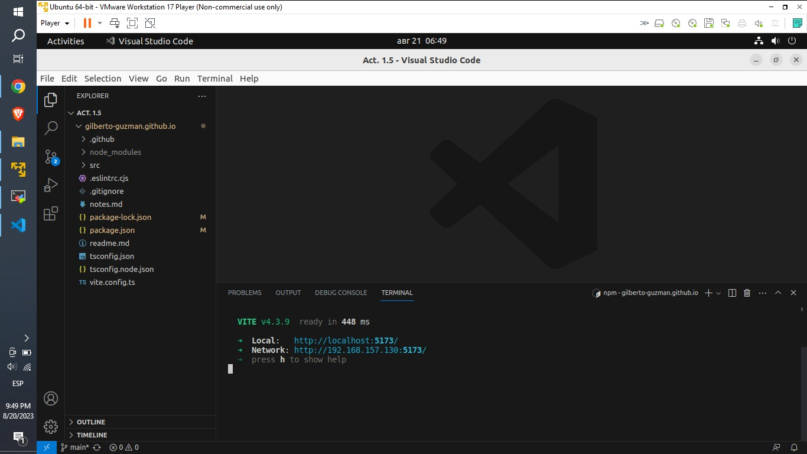
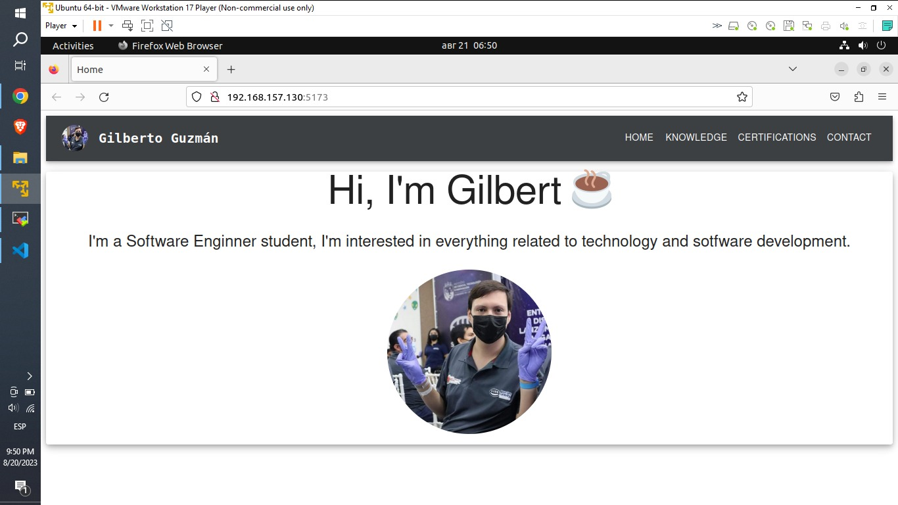
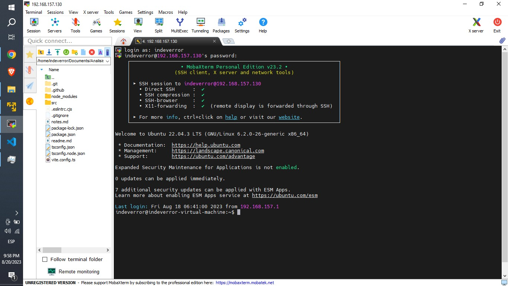
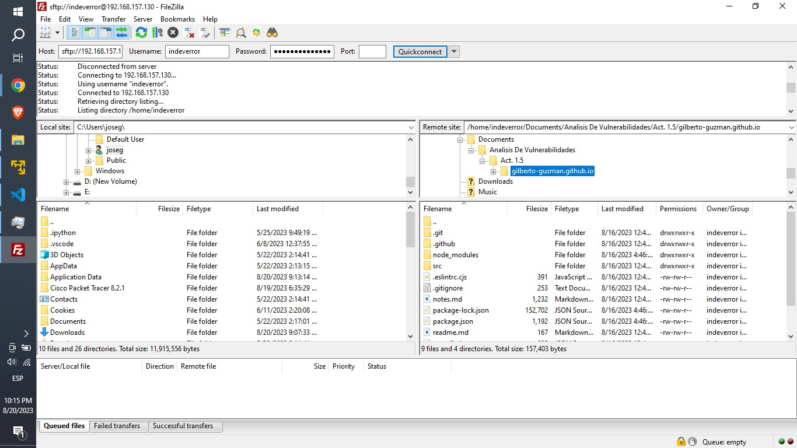

# Act. 1.5 Practica I.- Instalar el Servidor Web y Crear una página web con React

## Carpeta de Github

## A) Comandos para la descarga e instalación de dependencias en Ubuntu

### git
    sudo apt update
    sudo apt install git
    git --version

### Añadimos el proyecto en cuestion:

    git clone https://github.com/Gilberto-Guzman/gilberto-guzman.github.io

### Node JS
    curl -fsSL https://deb.nodesource.com/setup_18.x | sudo -E bash -
    udo apt-get install -y nodejs
    nodejs -v

### NPM
    sudo apt install npm
    npm -v
    npm install @mui/material
    npm install @emotion/styled
    npm install @fontsource/roboto
    npm install @mui/icons-material
    npm install @mui/lab notistack
    npm install @types/node -D 
    npm install react-material-ui-carousel --> website: https://learus.github.io/react-material-ui-carousel/
    npm install pdfjs-dist@3.4.120
    npm install @react-pdf-viewer/core
    @react-pdf-viewer/default-layout

## B) Inicializamos nuestro servidor de Ubuntu y comprobamos su funcionamiento

    npm run dev -- --host

## C) Nos conectamos remotamente mediante SSH

### Parametros
    Host: 192.168.157.130
    Username: indeverror
    Password: **********
    Port: 22

### MobaXterm

### FileZilla

Nota: Para la conexión me apoye de los siguientes videos
- Para MobaXterm: https://www.youtube.com/watch?v=edM9FuEzq5A
- Para FileZilla https://www.youtube.com/watch?v=5o_o0IsMa6Q