# Act. 1.6 Practica 2.-Realizar la siguiente practica de escaneo de puertos.

## Carpeta de Github.

https://github.com/Gilberto-Guzman/Analisis-de-Vulnerabilidades/tree/main/Act.%201.6

## ¿Qué es nmap?

Nmap es una herramienta ampliamente utilizada por ingenieros de seguridad de redes y piratas informáticos éticos para escanear puertos de redes, servicios de redes de firewall, etc.

## ¡Importante!

Antes de empezar tenemos que ver que herramientas vamos a estar utilizando:

- Con **vite** gestionamos nuestra web y abrimos algunos puertos para la realización de las pruebas con nmap.

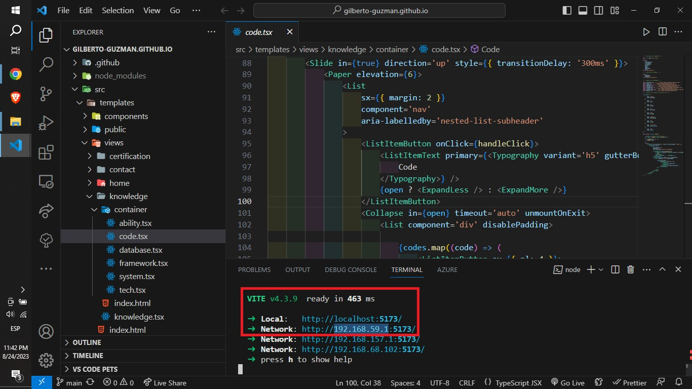

- Con **Zenmap**, ejecutaremos diversos comandos de **nmap** de manera mas dinamica y visual. 

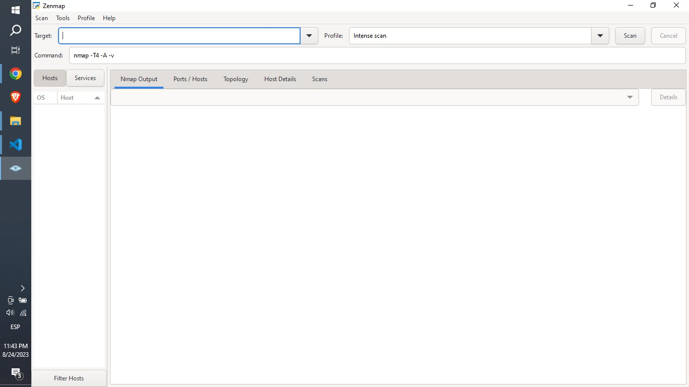

Sin embargo recuerda que puedes instarlo en tu distribución de linux favorita mediante el siguiente comando:
    
    sudo apt install nmap

O si gustas probar la interfaz grafica, checa este enlace: https://nmap.org/zenmap/

## Comandos

### 1. Escaneo de Objetivo Único.

    nmap 192.168.59.1

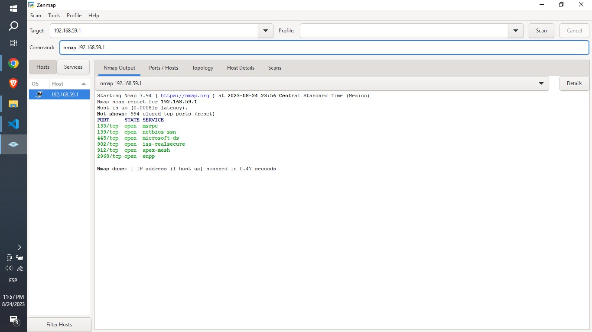

### 2. Escaneo de Múltiples Objetivos.

    nmap 192.168.59.1 192.168.157.1 192.168.68.102

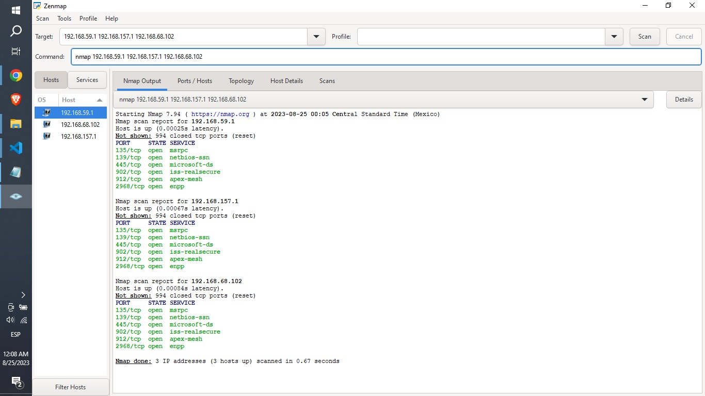

### 3. Rango de Escaneo del Objetivo.

    nmap -p 5173 192.168.1-200.1

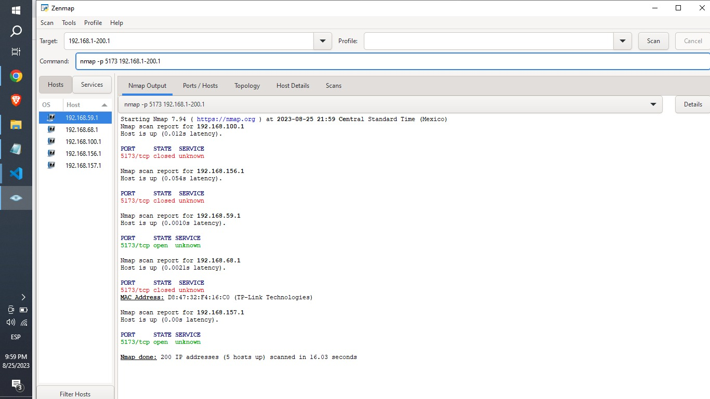

### 4. Escaneo de Subred Completa.

    nmap 192.168.1.0/24

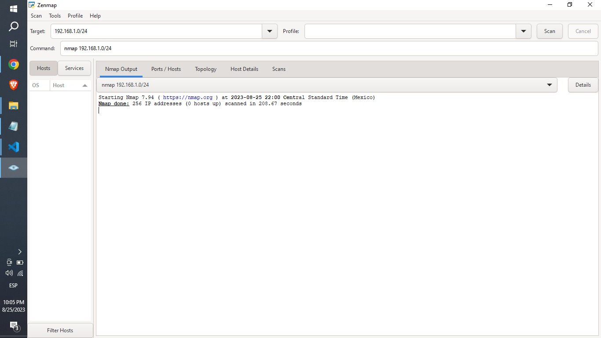

### 5. Escaneo desde Archivo de Texto.

    nmap -iL D:\testfile.txt

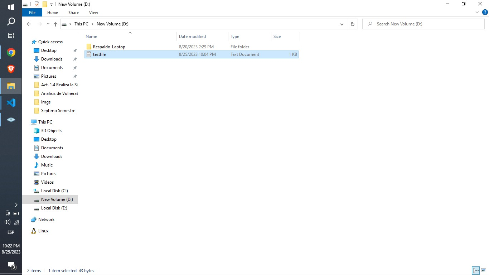
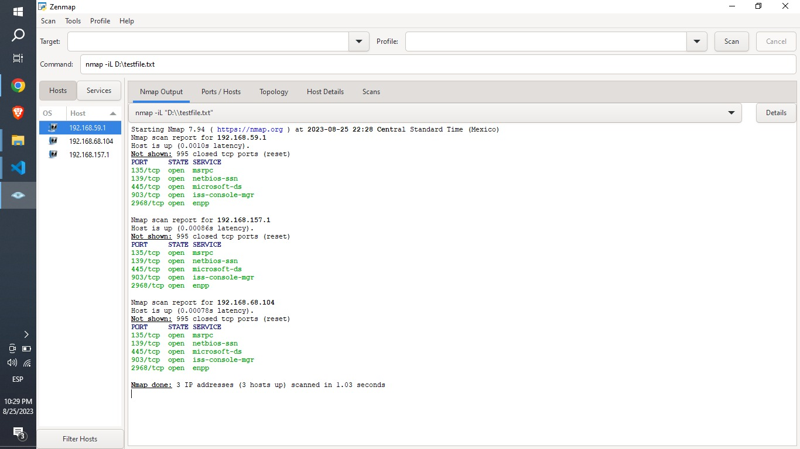

### 6. Escaneo de Objetivo Aleatorio.

    nmap -iR 3

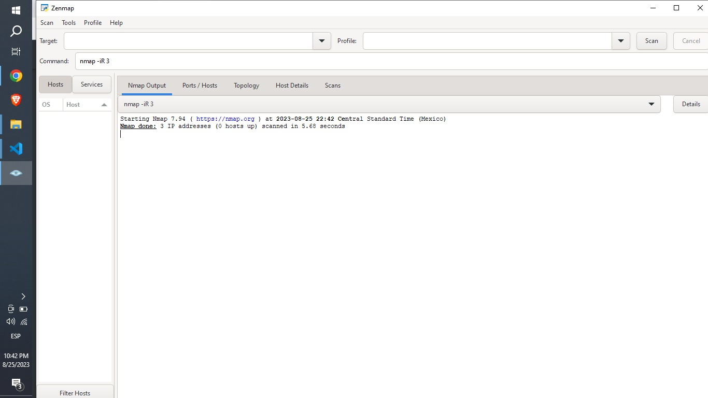

### 7. Escaneo Excluyendo un Objetivo.

    nmap --exclude 192.168.157.1,192.168.68.104 192.168.59.1

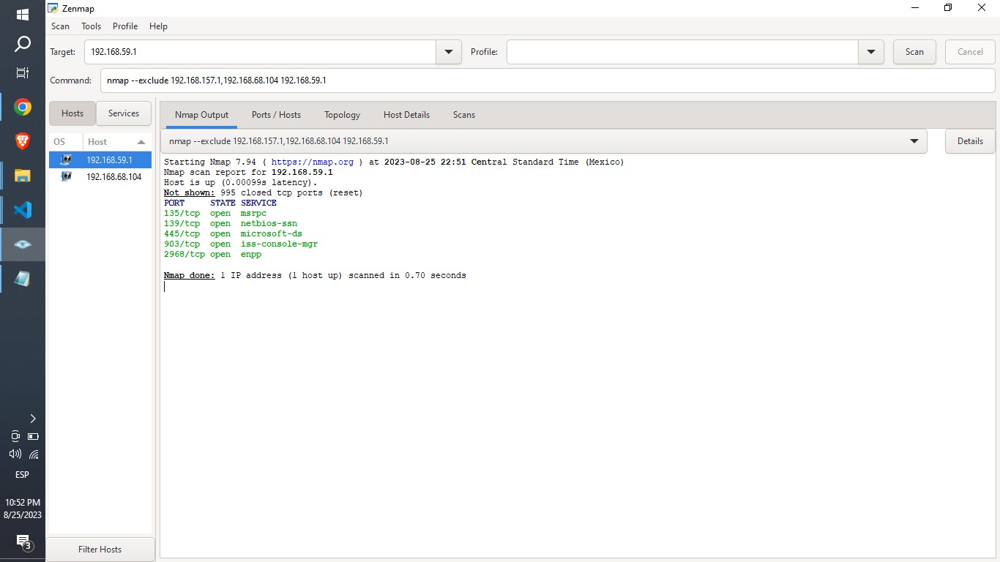

### 8. Escaneo Excluyendo una Lista de Objetivos.

    nmap --excludefile "D:\\testfile2.txt" 192.168.59.1

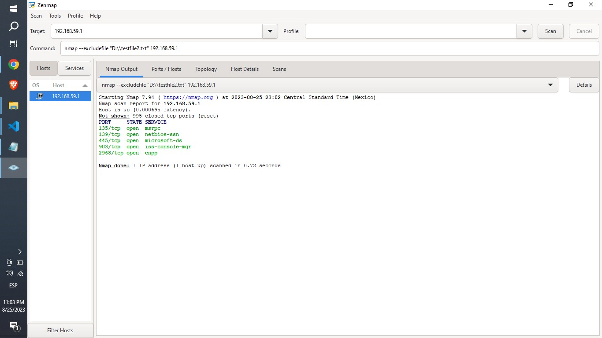

### 9. Escaneo Agresivo.

    nmap -A 192.168.59.1

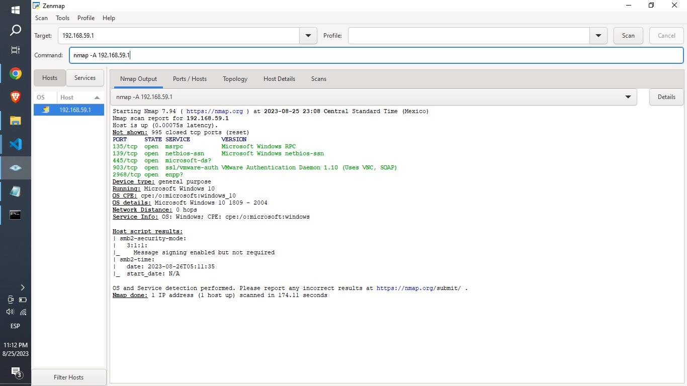

### 10. Escaneo de Objetivos IPv6.

Nota: para obtener la dirección IPV6 de 192.168.59.1, se utilizo este comando en cmd: 
    ipconfig /all

Comprendiendo lo anterior, prosigamos:

    nmap -6 fe80::7170:ce96:fc17:9175

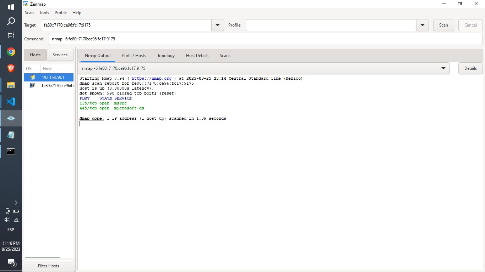
