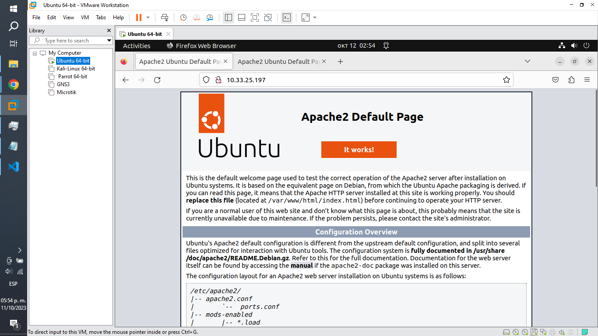
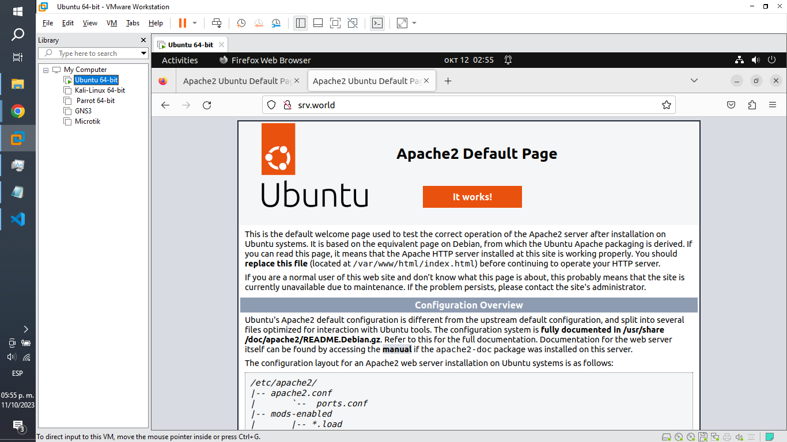

# Act. 3.2 Practica Proteccion de Directorio al Servidor Apache de la aplicacion DVWA

### 1. Configuración de 000-default.conf

Consultamos la siguiente ruta.

    cd /etc/apache2/sites-available/

y modificamos con nano contenido del archivo.

    sudo nano 000-default.conf

Código resultante.

    <VirtualHost *:80>
        # The ServerName directive sets the request scheme, hostname and port that
        # the server uses to identify itself. This is used when creating
        # redirection URLs. In the context of virtual hosts, the ServerName
        # specifies what hostname must appear in the request's Host: header to
        # match this virtual host. For the default virtual host (this file) this
        # value is not decisive as it is used as a last resort host regardless.
        # However, you must set it for any further virtual host explicitly.
        #ServerName www.example.com

        ServerAdmin webmaster@localhost
        ServerName srv.world
        DocumentRoot /var/www/html

        # Available loglevels: trace8, ..., trace1, debug, info, notice, warn,
        # error, crit, alert, emerg.
        # It is also possible to configure the loglevel for particular
        # modules, e.g.
        #LogLevel info ssl:warn

        ErrorLog ${APACHE_LOG_DIR}/error.log
        CustomLog ${APACHE_LOG_DIR}/access.log combined

        # For most configuration files from conf-available/, which are
        # enabled or disabled at a global level, it is possible to
        # include a line for only one particular virtual host. For example the
        # following line enables the CGI configuration for this host only
        # after it has been globally disabled with "a2disconf".
        #Include conf-available/serve-cgi-bin.conf
    </VirtualHost>

    # vim: syntax=apache ts=4 sw=4 sts=4 sr noet

### 2. Habilitación del VirtualHost.

    sudo a2dissite 000-default.conf
    systemctl reload apache2

### 3. Hacemos los cambios y verificamos su funcionamiento.

    sudo systemctl restart apache2
    sudo systemctl status apache2

### 4. Configuración de hosts.

Consultamos la siguiente ruta.

    cd /etc

y modificamos con nano contenido del archivo.

    sudo nano hosts

Código resultante.

    127.0.0.1	srv.world
    127.0.1.1	indeverror-virtual-machine

    # The following lines are desirable for IPv6 capable hosts
    ::1     ip6-localhost ip6-loopback
    fe00::0 ip6-localnet
    ff00::0 ip6-mcastprefix
    ff02::1 ip6-allnodes
    ff02::2 ip6-allrouters

### 5. Verificamos su funcionamiento.

Antes:

Despues:

