# Act. 3.3 Practica WAF AL DVWA INTALAR CERTIFICADO DE HTTP A HTTPS.- 50%

## Configuración del WAF.

    sudo apt install libapache2-mod-security2
    sudo a2enmod security2
    sudo nano /etc/modsecurity/modsecurity.conf-recommended
    sudo nano /etc/modsecurity/modsecurity.conf  
    cd /etc/modsecurity
    sudo git clone https://github.com/SpiderLabs/owasp-modsecurity-crs.git
    sudo mv owasp-modsecurity-crs/crs-setup.conf.example owasp-modsecurity-crs/crs-setup.conf
    sudo nano etc/modsecurity/modsecurity.conf
    sudo service apache2 restart

Nota: Por defecto no te aparecera modsecurity.conf, por lo cual tendras que hacer una copia de modsecurity.conf-recommended y luego renombrarlo a modsecurity.conf

## Configuración del HTTPS.

    sudo apt update
    sudo ufw allow "Apache Full"
    sudo a2enmod ssl
    sudo systemctl restart apache2
    sudo openssl req -x509 -nodes -days 365 -newkey rsa:2048 -keyout /etc/ssl/private/apache-selfsigned.key -out /etc/ssl/certs/apache-selfsigned.crt
    cd /etc/apache2/sites-available
    sudo nano apache2.conf

Aquí, actualizaremos esta información: 

    DocumentRoot /var/www/html

	SSLEngine on
    
    SSLCertificateFile /etc/ssl/certs/apache-selfsigned.crt
	SSLCertificateKeyFile /etc/ssl/private/apache-selfsigned.key

Y luego testearemos y reiniciaremos el servidor para reflejar los cambios.

    sudo apachectl configtest
    sudo a2ensite default-ssl.conf
    sudo systemctl reload apache2 

## Protección de rutas.

    cd /etc/apache2
    sudo nano apache2.conf

Aquí, actualizaremos esta información: 

    <Directory />
            Options FollowSymLinks
            AllowOverride None
            Require all denied
    </Directory>

    <Directory /usr/share>
            AllowOverride None
            Require all granted
    </Directory>

    <Directory /var/www/html>
            AllowOverride ALL
            Require all granted
    </Directory>

    <Directory /var/www/html/images>
            Options Indexes
    </Directory>

Y luego reiniciaremos el servidor para reflejar los cambios.

    service apache2 restart

## Testeando Parametros de Seguridad.

#### Waf.

    1' or '1'='1

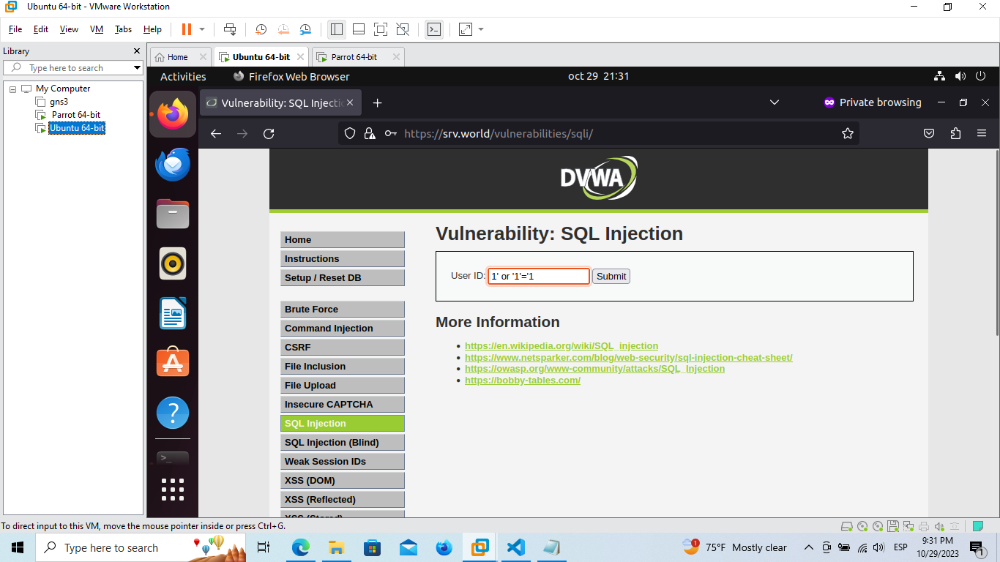

    

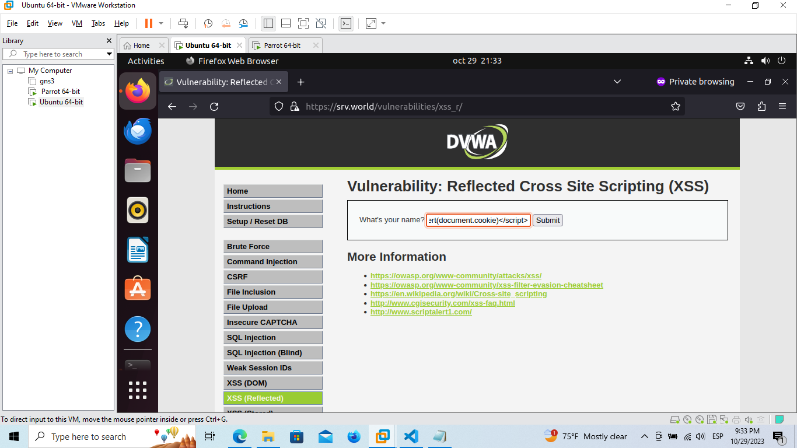
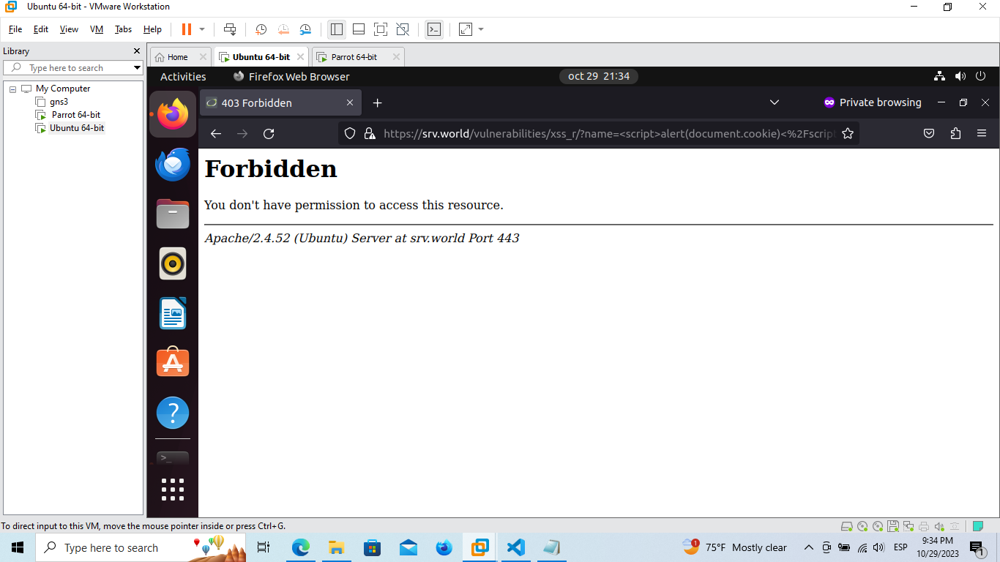

    sqlmap -u "https://192.168.18.129/dvwa/vulnerabilities/sqli/?id=1&Submit=Submit#"--cookie="PHPSESSID=36tr0lmnrmhdt7jkpq1u2cijvn;security=low"

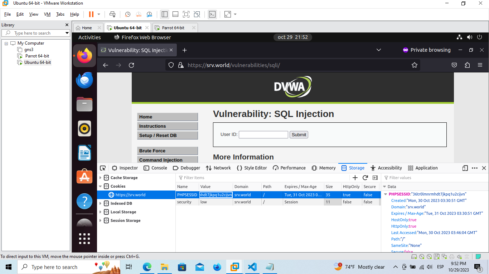
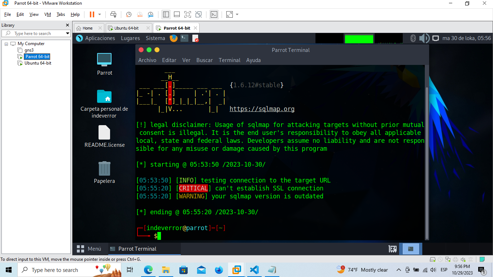

    cd slowloris.pl
    perl slowloris.pl -dns https://192.168.18.129 -num 100000

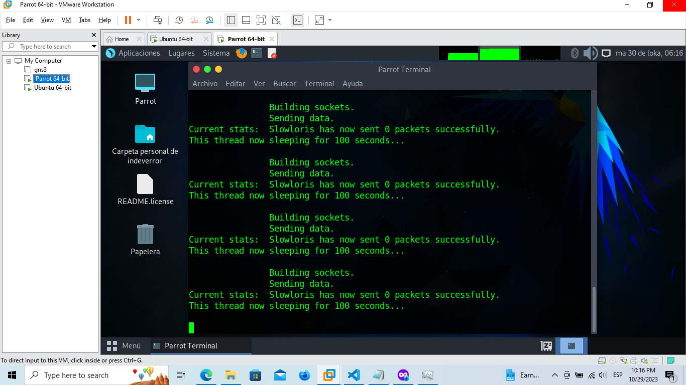
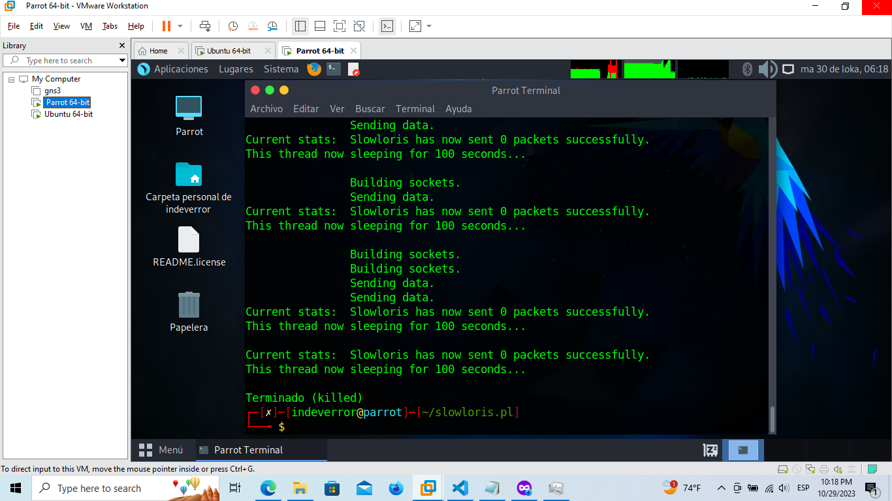

#### Rutas.

    http://srv.world/dvwa/docs/

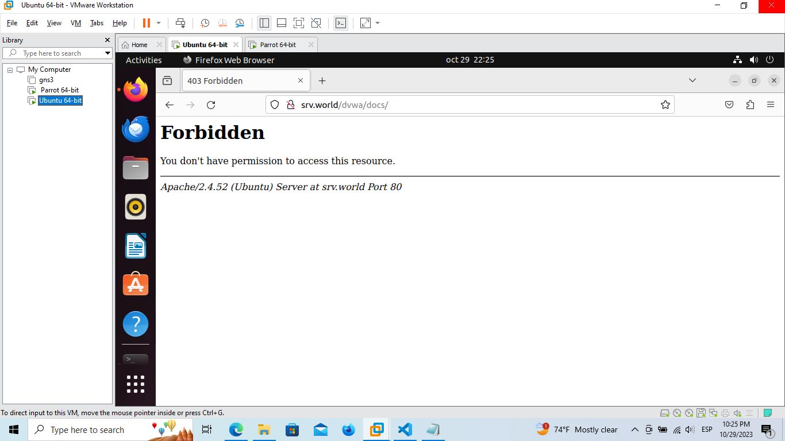

    http://srv.world/dvwa/dvwa/images/

Dato curioso, si habilitamos https, ni si quiera menciona que el contenido existe.

    https://srv.world/dvwa/docs/

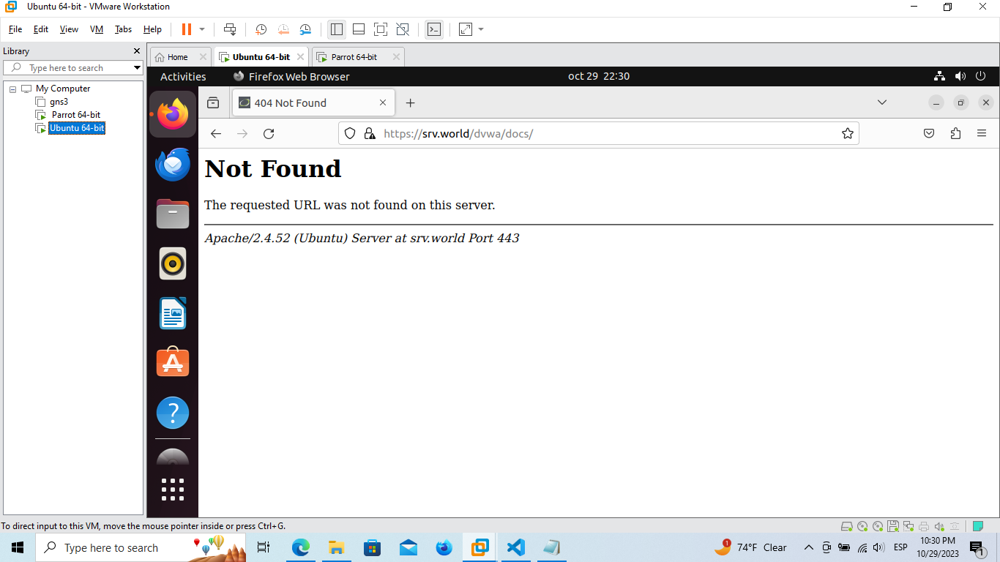

    https://srv.world/dvwa/dvwa/images/

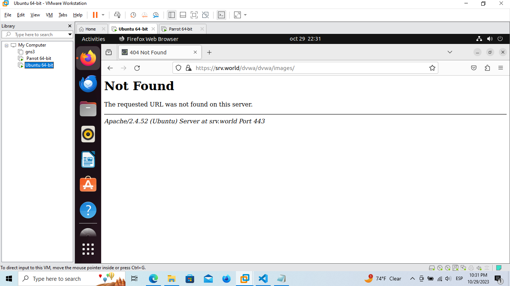

#### Extras.

hydra

    hydra 192.168.18.129 http-form-post "/dvwa/login.php:username=^USER^&password=^PASS^&Login=submit:Login failed" -L usernames.txt -P passwords.txt

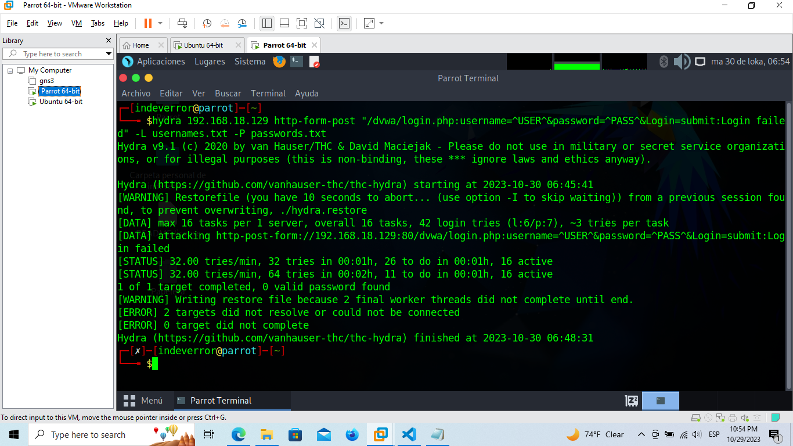

    hydra -l admin -p password 192.168.18.129 http-get-form "/dvwa/login.php:username=^USER^&password=^PASS^&Login=Login:H=Cookie: PHPSESSID=hqb1ok19j6s0g0rrf7gkmoliod; security=low:F=Username and/or password incorrect" -V

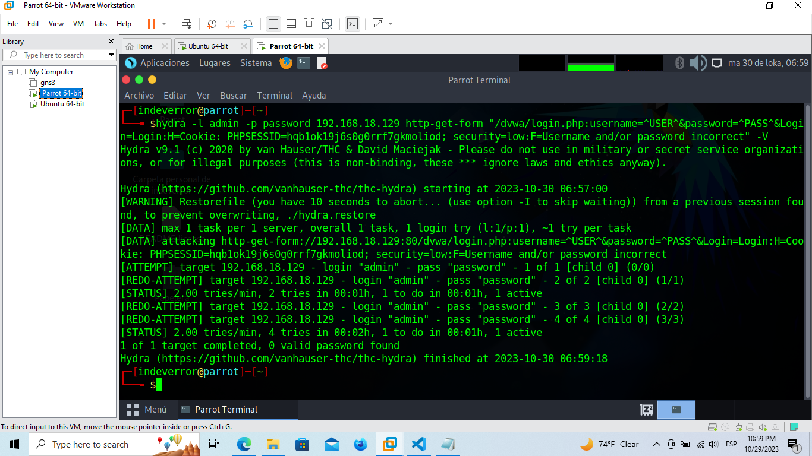

file uploads

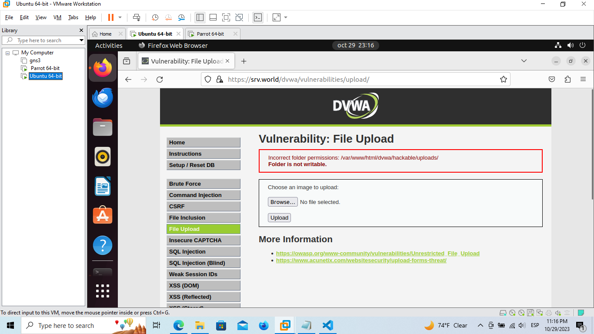