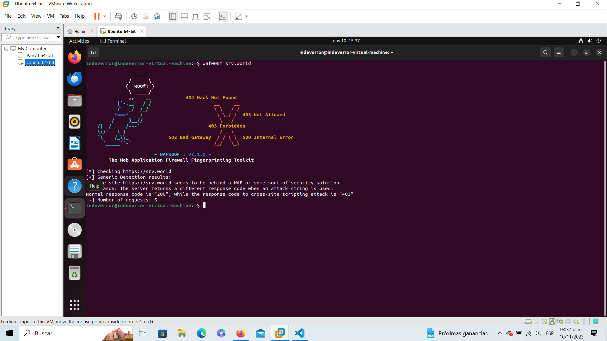
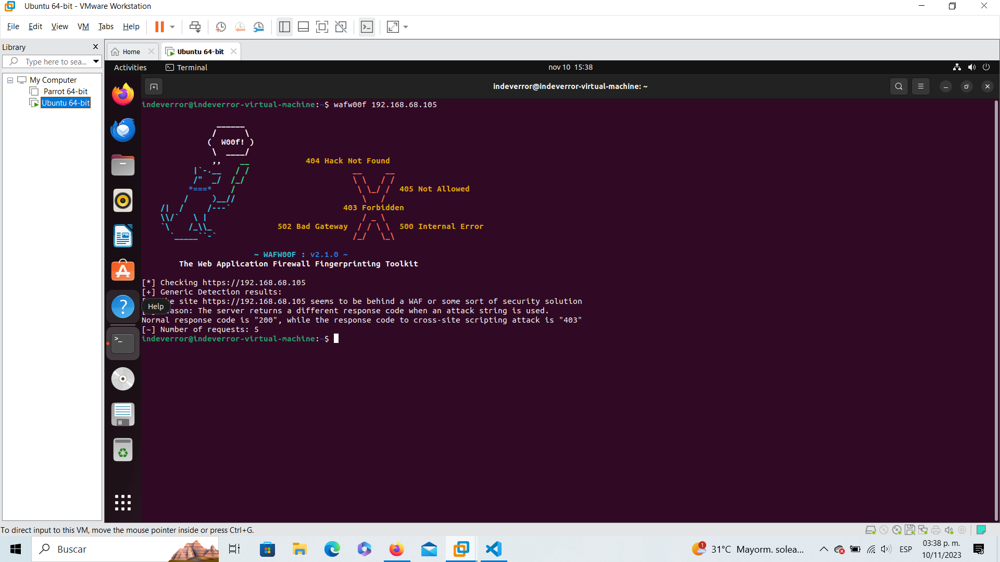

# Instalacion Adicional

### mod_evasive

    sudo apt-get install libapache2-mod-evasive
    sudo a2enmod evasive
    sudo nano /etc/apache2/mods-enabled/evasive.conf
    systemctl restart apache2

### wafw00f
    sudo apt install wafw00f
    wafw00f srv.world
    wafw00f 192.168.68.105

