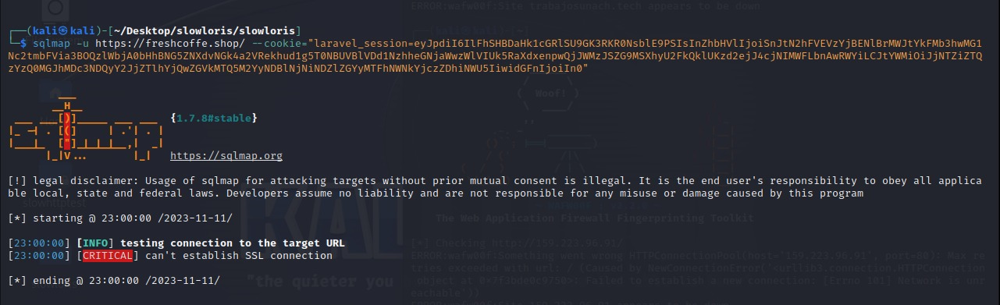

# Universidad Autónoma De Chiapas

## Utilizar todas las herramientas y realizar un reporte de auditoria de los ataques a los servidores web y bd en un VPS.

### **Catedrático:** Dr. Luis Gutiérrez Alfaro

### **Integrantes del equipo**

#### - José Gilberto Guzmán Gutiérrez.

#### - Jose Julian Molina Ocana.

#### - Bryan Andrew Castro Valencia.

#### Tuxtla Gutiérrez Chiapas. 11 de noviembre del 2023.

# https://freshcoffe.shop/ ➡ Cayo con Slow HTTP Test.

### SQL MAP

### Slow Loris

### Slow HTTP Test

### Burp Suite

